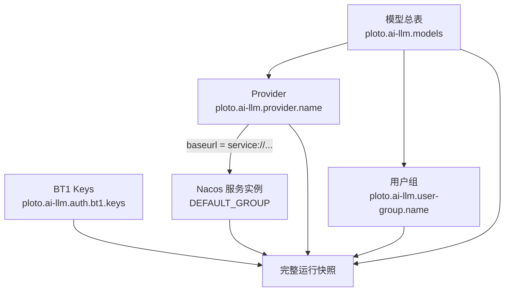

# ai-server 配置控制台前端需求与交互设计

## 1. 文档信息

| 项目 | 内容 |
| --- | --- |
| 文档状态 | 需求与交互设计初稿，可用于产品、前端、配置后台和 ai-server 联合评审 |
| 适用对象 | 产品、UI/UX、前端、配置后台、ai-server、测试、SRE、安全 |
| 配置基线 | `apps/ai-server` 当前 C++ 实现 |
| 动态配置组 | `LLM-SERVER` |
| 推荐字段风格 | kebab-case；BT1 配置保留现有 camelCase 字段 |
| 核心目标 | 用结构化、安全、可审计的方式管理 ai-server 配置，并准确展示发布与生效状态 |

本文设计的是 ai-server 的配置管理控制台，不是终端用户调用 LLM 的聊天产品。
控制台包含配置编辑、依赖管理、校验、发布、回滚、运行状态和审计能力，同时给出
配置后台所需的领域模型与接口契约。

本文中的“必须”表示首个可生产版本的契约；“建议”表示可以后续迭代，但数据模型和
页面布局应预留位置。

## 2. 设计依据与已知边界

### 2.1 ai-server 当前配置模型

ai-server 有两类配置，生命周期完全不同：

1. **进程启动配置**：dotenv 文件，包含监听、Nacos、实例注册和 CAT 参数。变更后需
   重新部署或重启进程。
2. **LLM 动态业务配置**：Nacos JSON 配置，ai-server 监听更新并构建不可变快照，
   包含 BT1 key、Provider、用户组和模型路由。

动态配置依赖关系如下：



首次启动时，BT1 key、模型总表以及模型引用的全部 Provider、用户组都必须有效。
`service://` Provider 还必须至少收到一次服务发现结果，结果可以是空实例列表。
完整快照安装前 ai-server 不对外提供业务服务。运行期间非法更新会被拒绝，旧的完整
快照继续服务。

### 2.2 发布状态不能合并展示

控制台必须区分以下状态：

| 状态 | 含义 | 证据来源 |
| --- | --- | --- |
| 草稿已保存 | 配置后台已保存用户修改，尚未写入 Nacos | 配置后台数据库 |
| 已发布 | 目标内容已成功写入 Nacos | Nacos 发布结果与 MD5 |
| 生效中 | Nacos 已更新，尚未确认所有目标实例接受 | 实例状态聚合 |
| 已生效 | 目标实例均已安装包含本次变更的完整快照 | ai-server 状态接口 |
| 部分生效 | 仅部分目标实例确认新配置 | ai-server 状态接口 |
| 生效失败 | 实例明确拒绝配置或超时未达到发布策略 | ai-server 状态接口 |
| 已回滚 | 已重新发布历史内容，并按同样规则确认生效 | 发布记录与实例状态 |

Nacos 的多个 Data ID 不具备跨配置事务。配置后台即使按正确顺序写入，也不能把
“Nacos 写入成功”描述为整个配置集原子切换。对于同时修改多个现有 Provider、用户组
和模型的发布，当前 ai-server 可能在不同时间点接受各项更新。

因此：

- 前端不得只显示一个含糊的“成功”Toast；
- 发布详情必须展示每个资源的写入状态和每个实例的生效状态；
- 严格的跨 Data ID 原子发布需要后续扩展 ai-server 配置协议，见第 18 节。

### 2.3 当前运行时观测缺口

当前 ai-server 提供：

- `GET /health`：进程存活；
- `GET /ready`：完整配置快照和限流成员环是否就绪；
- `GET /metrics`：包括 `ai_server_config_generation`；
- 进程内 `LlmConfigManager` 保存最后一次失败信息，但没有对外状态接口。

仅靠上述接口无法证明某个 Data ID 的指定 MD5 是否被每个实例接受。生产版控制台要
实现“已生效”，必须补充受保护的实例配置状态接口或等价的状态上报机制。

## 3. 产品目标与非目标

### 3.1 产品目标

- 使用表单管理配置，用户无需手写 Nacos JSON。
- 在编辑阶段完成字段、引用、协议覆盖和安全校验。
- 清晰展示模型、Provider、用户组、密钥之间的依赖和变更影响。
- 支持草稿、差异预览、审批、发布、生效确认、回滚和完整审计。
- 所有 secret 都按只写敏感数据处理，列表、详情、日志和差异中不可回显明文。
- 对存量 Nacos 配置提供安全导入和一致性检查。
- 让运维人员能判断“配置未发布”“已发布未生效”“实例拒绝”三类问题。

### 3.2 非目标

- 不在控制台实现通用 Nacos 配置中心。
- 不允许用户任意修改 Data ID 或 group。
- 不提供 OpenAI 与 Anthropic 的协议转换配置；C++ ai-server 只执行同协议调用。
- 不把 Provider token、BT1 secret、Nacos 密码展示给任何角色。
- 首版不管理对话内容、Prompt 模板、账单或模型定价。
- 首版不直接编辑 Nacos 服务实例；`service://` 实例来自 NamingService。
- `openai-embedding` 虽可被解析，但当前没有入站接口，控制台不应将其显示为“可用”。

## 4. 用户角色与权限

建议采用环境级 RBAC。用户可以在不同环境拥有不同角色。

| 能力 | 只读者 | 编辑者 | 发布者 | 管理员 | 审计员 |
| --- | --- | --- | --- | --- | --- |
| 查看配置与依赖 | 是 | 是 | 是 | 是 | 是 |
| 查看已脱敏运行状态 | 是 | 是 | 是 | 是 | 是 |
| 创建和编辑草稿 | 否 | 是 | 是 | 是 | 否 |
| 查看 secret 是否已配置 | 是 | 是 | 是 | 是 | 是 |
| 新增或替换 secret | 否 | 是 | 是 | 是 | 否 |
| 提交发布申请 | 否 | 是 | 是 | 是 | 否 |
| 审批和发布 | 否 | 否 | 是 | 是 | 否 |
| 回滚 | 否 | 否 | 是 | 是 | 否 |
| 管理环境和启动配置 | 否 | 否 | 否 | 是 | 否 |
| 查看完整审计记录 | 否 | 否 | 否 | 是 | 是 |

权限规则：

- 生产环境建议启用编辑与发布职责分离，草稿作者不能审批自己的发布单。
- 查看权限只返回 `configured: true/false` 和 secret 指纹后缀，不返回密文或明文。
- 删除 BT1 key、删除 Provider token、清空用户组、把模型额度改为 `0` 属于高风险操作，
  必须二次确认并填写原因。
- 所有写接口都必须在后台再次鉴权，不能依赖前端隐藏按钮。

## 5. 核心概念和用户语言

页面使用以下业务语言，技术标识放在辅助信息中：

| 用户语言 | 技术对象 |
| --- | --- |
| 环境 | 一组 Nacos namespace/tenant、目标 ai-server 集群及发布策略 |
| 模型 | `ploto.ai-llm.models` 中的一个 ModelDefinition |
| Provider | `ploto.ai-llm.provider.<name>` |
| 用户组 | `ploto.ai-llm.user-group.<name>` |
| BT1 密钥 | `ploto.ai-llm.auth.bt1.keys` 中的一条 key |
| 启动配置 | ai-server dotenv 配置，不属于 `LLM-SERVER` 动态配置 |
| 草稿 | 尚未发布的结构化配置版本 |
| 发布单 | 一次不可变的差异、审批和执行记录 |
| 期望状态 | 最近一次目标发布对应的内容 |
| Nacos 状态 | Nacos 当前读取到的内容和 MD5 |
| 运行状态 | ai-server 实例实际接受的快照 |

## 6. 信息架构

全局导航：

```text
环境选择器
├── 概览
├── 模型
├── Provider
├── 用户组
├── BT1 密钥
├── 发布中心
│   ├── 草稿
│   ├── 待审批
│   └── 发布历史
├── 运行状态
│   ├── 实例
│   ├── 配置生效
│   └── 服务发现
├── 启动配置
└── 审计日志
```

全局顶栏包含：

- 当前环境与集群；
- 环境标签，例如 `开发`、`预发`、`生产`；
- 当前整体状态：就绪、发布中、部分生效、异常；
- 当前用户与角色；
- 文档和操作入口。

环境切换时必须清空未提交页面状态。若当前表单有未保存修改，先弹出离开确认。
生产环境使用固定醒目色和“生产”文字标识，但不能只依赖颜色表达。

## 7. 全局交互规范

### 7.1 列表

所有资源列表统一提供：

- 关键词搜索；
- 状态和引用筛选；
- 服务端排序和分页；
- URL 保存筛选、排序、页码；
- 刷新；
- 新建按钮；
- 批量导出；首版不支持批量删除；
- 空状态、加载骨架、请求失败重试。

列表行点击进入详情。行内操作菜单只包含低频操作，例如复制、导出、删除。编辑使用
详情页主按钮，避免误触。

### 7.2 详情和编辑

详情页使用“查看态”和“编辑态”：

- 查看态展示已发布配置、草稿提示、依赖、版本和生效状态；
- 点击“编辑”后基于当前最新修订创建或打开个人草稿；
- 保存草稿只写后台数据库，不发布；
- 离开有未保存修改的页面时进行拦截；
- 同一资源已存在他人草稿时展示作者和更新时间，可查看但不可覆盖；
- 保存时携带 `revision`/`ETag`，发生并发冲突返回差异合并页。

### 7.3 校验反馈

校验分三层：

1. 字段输入时：格式、必填、范围、重复；
2. 保存草稿时：对象级关系；
3. 提交发布时：全环境依赖图、secret、Nacos 连通性和风险策略。

错误必须定位到字段或表格行。顶部汇总只作导航，不替代字段旁错误。后台错误使用
稳定 `code + path + message`，例如：

```json
{
  "code": "VALIDATION_FAILED",
  "errors": [
    {
      "path": "/models/company-chat/providers/1",
      "rule": "REFERENCE_NOT_FOUND",
      "message": "Provider openai-b 不存在"
    }
  ]
}
```

### 7.4 状态表达

状态标签同时使用图标、文字和颜色：

- 灰色：草稿、未知；
- 蓝色：发布中、生效中；
- 绿色：已生效、健康；
- 黄色：警告、部分生效、未被引用；
- 红色：失败、配置漂移、实例拒绝。

“已保存”只能表示草稿保存；“已发布”只能表示 Nacos 写入完成；“已生效”必须有实例
证据。

### 7.5 危险操作

危险操作弹窗必须显示：

- 操作对象；
- 受影响模型或实例；
- 预期业务影响；
- 操作原因输入；
- 必要时输入资源名二次确认。

仅使用“确定/取消”且不解释影响的弹窗不符合要求。

## 8. 概览页

### 8.1 页面目标

让用户在进入环境后的 10 秒内回答：

- 当前集群能否提供服务；
- 是否有待发布或未完全生效的变更；
- 哪些配置存在风险；
- 最近一次发布是谁、何时、结果如何。

### 8.2 页面结构

```text
┌ 环境：生产 / cluster-a                         整体状态：部分生效 ┐
├ 就绪实例 5/6 ─ 配置 generation 128 ─ 待发布草稿 2 ─ 告警 3      ┤
├ 最近发布：#R-1024  发布者 Alice  12:31  [查看详情]              ┤
├ 配置健康                                                     ┤
│  BT1 Key 2   模型 16   Provider 7   用户组 5   引用异常 0       │
├ 生效矩阵                                                     ┤
│  instance-a √  instance-b √  instance-c 等待  ...              │
├ 风险提示                                                     ┤
│  · internal-llm 当前无健康服务实例                            │
│  · key-old 将在计划中删除                                    │
└ 最近操作与快捷入口                                            ┘
```

### 8.3 数据和交互

- “就绪实例”读取实例 `/ready` 聚合结果。
- generation 显示最小值、最大值；不一致时显示 `127–128`，不能只显示最大值。
- 配置对象数量来自后台规范化配置，不直接统计 Nacos Data ID 前缀。
- 风险卡片点击跳转到对应资源和定位区域。
- 最近发布卡片展示 Nacos 写入、生效实例和超时实例的分段进度。
- 无运行状态接入时，明确显示“运行状态未接入”，不得推断为健康。

## 9. 模型管理

### 9.1 模型列表

列定义：

| 列 | 内容 |
| --- | --- |
| 模型名 | 逻辑模型名，支持复制 |
| 协议可用性 | 根据所选 Provider 的协议交集计算 OpenAI/Anthropic 可用性 |
| 主 Provider | 名称列表，超出两项折叠 |
| Fallback | Provider 名或“未配置” |
| 授权范围 | 全部认证用户或 N 个用户组 |
| 限流 | 不限流、额度摘要或“全部拒绝” |
| 状态 | 草稿、已发布、生效中、已生效、异常 |
| 更新时间 | 最近草稿或发布更新时间 |

筛选项：

- OpenAI 可用、Anthropic 可用、双协议、无可执行协议；
- 是否配置 fallback；
- 是否限流；
- 用户组；
- Provider；
- 状态。

### 9.2 新建/编辑模型

采用一个页面中的分区表单，不使用强制多步向导；各分区可独立折叠，右侧固定显示
校验和影响摘要。

#### 基本信息

| UI 字段 | 控件 | 必填 | 规则 | 运行语义 |
| --- | --- | --- | --- | --- |
| 模型名 | 文本框 | 是 | 1..128 字节，`[A-Za-z0-9_.-]`，环境内唯一 | 客户端请求中的逻辑 `model` |
| 主 Provider | 可排序多选 | 条件必填 | 不重复；为空时必须配置 fallback | 决定主尝试候选 |
| Fallback Provider | 单选 | 否 | 不能与主 Provider 重复 | 在主尝试之后追加 |

模型名创建后不支持直接重命名。重命名采用“复制为新模型 -> 发布 -> 迁移客户端 ->
删除旧模型”的引导流程，避免调用方无感中断。

Provider 选择器每个选项显示：

- Provider 名；
- 固定地址或服务发现；
- 已配置协议；
- token 数量；
- 当前实例可用性；
- 是否有未发布草稿。

拖拽主 Provider 顺序不会决定最终调用顺序。ai-server 使用 Rendezvous Hash 排序。
前端必须在控件旁说明这一点，避免给用户错误暗示。

#### 协议覆盖预览

页面根据全部主 Provider 和 fallback 的协议配置实时计算：

| 入口 | 可用 Provider | 缺失 Provider | 结论 |
| --- | --- | --- | --- |
| OpenAI Chat Completions | openai-a、internal | legacy | 可用 |
| Anthropic Messages | internal | openai-a、legacy | 仅 1 个候选 |
| Embedding | openai-a | - | 不可调用：ai-server 无入站路由 |

如果模型没有任何 `openai-chat-completions` 或 `anthropic-messages` 候选，允许保存
草稿，但默认阻止提交发布。管理员可以在有明确原因时走策略豁免；即使豁免，页面仍
显示红色风险。

#### 访问控制

| UI 字段 | 控件 | 默认值 | 规则 |
| --- | --- | --- | --- |
| 访问范围 | 单选：全部认证用户/指定用户组 | 全部认证用户 | 切换为指定用户组后至少选择一组 |
| 允许用户组 | 多选 | 空 | 名称不重复；引用必须存在 |

`allow-user-groups` 缺失或空数组在运行时表示所有已认证用户都可访问。为防止误解，
前端不直接展示空数组，而展示明确单选项。

从“指定用户组”切回“全部认证用户”时弹出风险提示，因为这会扩大访问范围。

#### 负载均衡与重试

高级设置默认折叠，展示当前摘要。

| UI 字段 | 配置字段 | 控件和默认值 | 校验和说明 |
| --- | --- | --- | --- |
| Provider 选择策略 | `policy` | 只读 `rendezvous-hash` | 当前只有一个有效策略 |
| 路由键来源 | `hash-source` | 只读 `prompt-prefix` | 当前只有一个有效来源 |
| Prompt 前缀上限 | `prefix-max-bytes` | 数字，默认 2048 bytes | 1..2147483647；空值写默认值 |
| 主 Provider 尝试上限 | `max-primary-attempts` | 数字，默认 0 | 0 表示全部；大于 0 时限制不同主 Provider 数 |
| 启用 Fallback | `fallback-enabled` | 开关，默认开 | 未选择 fallback 时禁用并显示说明 |
| 可重试 HTTP 状态 | `retryable-status` | 标签数字输入 | 100..599，去重、升序；空输入恢复默认集合 |
| 服务实例策略 | `service-instance-policy` | 单选，默认平滑加权轮询 | 仅影响 `service://` Provider |

服务实例策略值：

- `smooth-weighted-round-robin`；
- `weighted-rendezvous`。

需明确展示：

- `max-primary-attempts` 限制不同主 Provider，不限制 token 产生的 HTTP 总尝试数；
- 401、403、429 和传输错误本身可触发后续尝试，其中 429 也在默认重试集合；
- SSE 成功响应头开始发送后不再重试或 fallback；
- 运行时对小于等于 0 的 `prefix-max-bytes` 使用默认值，对小于等于 0 的
  `max-primary-attempts` 使用 0。控制台只生成规范化非负值。

#### Token 限流

使用“启用 token 限流”开关控制 `rate-limit` 对象是否存在。

| UI 字段 | 控件 | 必填 | 规则 |
| --- | --- | --- | --- |
| 窗口时长 | 数字 + 单位选择 | 启用时是 | 转换为毫秒后大于 0，且在 int64 范围内 |
| 每窗口最大 token | 非负整数 | 启用时是 | 大于等于 0 |

交互要求：

- 单位支持秒、分钟、小时；保存时只写 `window-duration-millis`；
- 显示换算后的精确毫秒数；
- `max-tokens-per-window = 0` 时显示红色提示“该模型所有请求将从首次检查起被拒绝”，
  提交发布时要求二次确认；
- 关闭限流表示删除规则，不是把额度设为 0；
- 限流 key 是 `username + model`，页面说明额度按用户分别计算；
- 模型配置内容改变会生成新的规则 revision，在途请求仍结算到旧 revision。

### 9.3 模型详情

详情页包含：

- 配置摘要；
- OpenAI/Anthropic 执行候选预览；
- Provider 和用户组依赖；
- 当前草稿与已发布差异；
- 各实例生效状态；
- 历史版本；
- 操作审计。

“执行候选预览”只展示静态最大计划，运行时仍会过滤熔断 Provider、暂停 token 和
空服务实例。不得承诺一次请求一定按页面顺序调用。

### 9.4 删除模型

删除模型实际是从模型总表中移除：

- 显示逻辑模型名和最近请求量（如已接入）；
- 要求输入模型名；
- 说明删除后新请求将得到统一 403 外观；
- 删除操作通过发布单生效，不能即时删除；
- 支持在历史发布中回滚。

## 10. Provider 管理

### 10.1 Provider 列表

| 列 | 内容 |
| --- | --- |
| Provider 名 | Data ID 后缀 |
| 地址类型 | HTTP、HTTPS、服务发现 |
| 地址/服务名 | 脱敏后展示完整非 secret 地址 |
| 协议 | OpenAI Chat、Anthropic、Embedding |
| API token | 0 个、N 个、待轮换 |
| 引用模型 | 数量和快捷弹层 |
| 运行状态 | 固定地址未知/可测试，服务实例 N 个 |
| 配置状态 | 草稿、已发布、生效状态 |

### 10.2 新建/编辑 Provider

#### 基本信息与地址

| UI 字段 | 配置字段 | 必填 | 规则 |
| --- | --- | --- | --- |
| Provider 名 | Data ID 后缀、`data.provider` | 是 | 1..128 字节，`[A-Za-z0-9_-]`，环境内唯一 |
| 地址类型 | 由 `data.baseurl` scheme 决定 | 是 | HTTP、HTTPS、服务发现 |
| Base URL | `data.baseurl` | 是 | 见下方规则 |

Base URL 规则：

- 支持 `http://`、`https://`、`service://`；
- 末尾 `/` 在保存预览中规范化移除；
- HTTP/HTTPS 必须有合法主机，可选端口 `1..65535`；
- IPv6 literal 必须写成 `[IPv6]`；
- 不允许用户信息、query、fragment 和反斜杠；
- `service://` 后为 1..1024 字节服务名，不允许空白、`/`、`?`、`#`；
- `service://` 固定使用 NamingService group `DEFAULT_GROUP`；
- `service://` 当前按 HTTP 连接实例，不提供通过该 scheme 配置 TLS。

地址类型切换会清空不兼容输入，需二次确认。Provider 名创建后不允许原地重命名。

服务发现类型显示只读实例面板：

- 服务名和 group；
- 最近更新时间；
- 总实例、可用实例、过滤实例；
- 可用实例的 IP、端口、权重、cluster；
- 被过滤原因：disabled、unhealthy、非正权重、非法 IP/port。

#### API token

token 使用可排序表格：

| 列 | 交互 |
| --- | --- |
| token 名 | 必填、同一 Provider 内唯一 |
| 凭证 | 新增时输入两次；已存在时只显示“已配置 · 指纹后 6 位” |
| 状态 | 保留、新增、待替换、待删除 |
| 操作 | 替换、删除 |

规则：

- `api-tokens` 缺失或空数组是合法配置，表示无凭证调用；
- token 名和 token 值都不能为空；
- ai-server 不要求 token 名符合 Provider 名的字符集，控制台允许可打印字符，但去除
  首尾空白并限制为 128 字符；
- token 值最长建议限制为 16 KiB，具体上限由安全评审确认；
- 已保存 secret 永不回显；用户编辑其他字段时后台保留原值；
- 删除最后一个 token 时提示“上游调用将不再发送 Authorization 头”；
- 替换 token 不改变 token 名；若要轮换且希望旧新并存，应新增新名称，发布并观察后
  再删除旧名称；
- 差异页只能显示“新增/替换/删除 secret”，不可显示值。

#### 协议

协议使用卡片列表，同一 `type` 只能有一条。

| 字段 | 必填 | 规则 |
| --- | --- | --- |
| 协议类型 | 是 | `openai-chat-completions`、`anthropic-messages`、`openai-embedding` |
| 请求路径 | 是 | 非空，必须以 `/` 开头 |
| 上游模型 | 是 | 非空 |

至少配置一个协议。路径拼接结果以只读方式展示：

```text
https://llm.example.com/base + /v1/messages
```

实际实现按 Provider endpoint 的 base path 和协议 path 组合，后台必须使用与
ai-server 相同的拼接和合法性校验，测试按钮也必须调用同一结果。

`openai-embedding` 卡片始终显示黄色提示：“配置可被 ai-server 加载，但当前没有
Embedding 入站路由，不能通过网关调用。”

若 Provider 被某模型引用，删除其唯一可执行协议时展示受影响模型列表。默认阻止
发布导致所有入口协议均不可用的模型配置。

### 10.3 连通性测试

建议提供两类测试，并明确测试不等于发布：

1. **地址探测**：DNS/TCP/TLS 或服务发现实例可达性，不发送业务请求；
2. **协议测试**：由用户提供最小测试请求，使用待发布配置请求指定 Provider。

安全要求：

- 测试由配置后台或受控探测器发起，浏览器不直连 Provider；
- 不在响应中返回 Authorization；
- 请求体和响应体默认不持久化；
- 生产环境协议测试需要额外权限和审计；
- 测试超时与正式请求超时分别配置；
- 测试失败不能自动阻止保存草稿，但可按环境策略阻止发布。

首版可以只实现地址解析和 `service://` 实例检查，将协议测试列为后续能力。

### 10.4 删除 Provider

- 被已发布模型或草稿引用时禁止直接删除；
- 展示全部引用位置，并提供“前往模型修改”；
- 未被引用时允许提交删除发布单；
- 删除 Nacos Data ID 前必须先发布不再引用它的模型总表；
- 由于运行时对 NotFound 更新会保留旧值，删除完成不能作为即时失效手段。

## 11. 用户组管理

### 11.1 用户组列表

| 列 | 内容 |
| --- | --- |
| 组名 | Data ID 后缀 |
| 用户数 | 去重后的非空用户名数 |
| 引用模型 | 数量 |
| 访问影响 | 估算可访问模型数量 |
| 状态 | 草稿和生效状态 |
| 更新时间 | 最近更新时间 |

### 11.2 新建/编辑用户组

| UI 字段 | 配置字段 | 必填 | 规则 |
| --- | --- | --- | --- |
| 组名 | Data ID 后缀、`data.name` | 是 | 1..64 字节，`[A-Za-z0-9_-]`，环境内唯一 |
| 用户 | `data.users` | 否 | 精确匹配、区分大小写；空字符串忽略；重复项去重 |

用户编辑器支持：

- 单个添加；
- 多行粘贴；
- CSV 单列导入；
- 搜索、排序、虚拟滚动；
- 重复项和空行预览；
- 导出不包含其他敏感信息。

保存前展示规范化结果，例如“输入 1,024 行，去除 20 个空行和 4 个重复项，最终
1,000 个用户”。

用户名规则来自 BT1 principal，ai-server 当前只做字符串精确匹配，没有额外字符集
限制。控制台不得擅自改成大小写不敏感。

### 11.3 清空和删除

- 清空 `users` 表示组存在但无人命中；
- 被模型引用的组允许清空，但属于高风险操作；
- 被引用时禁止删除 Data ID；
- 删除前必须先发布模型取消引用；
- 组名不支持原地重命名。

## 12. BT1 密钥管理

### 12.1 页面结构

页面顶部展示：

- 允许的时钟偏差；
- 当前 key 数量；
- 最近轮换时间；
- 各实例生效状态；
- 轮换引导。

key 列表展示：

| 列 | 内容 |
| --- | --- |
| Key ID | `kid` |
| Secret | 永远显示 `已配置 · 指纹后 6 位` |
| 状态 | 已生效、新增待发布、待删除、轮换中 |
| 引入版本 | 首次由后台记录的发布版本 |
| 更新时间 | 最近一次替换时间 |

### 12.2 字段和校验

| UI 字段 | 配置字段 | 规则 |
| --- | --- | --- |
| 时钟偏差 | `data.clockSkewSec` | 整数 0..300 秒，默认 0 |
| Key ID | `keys[].kid` | 1..16 字节，`[A-Za-z0-9_-]`，不可重复 |
| Secret | `keys[].secret` | 非空，建议生成 32 字节随机值并以 `base64:` + 标准 Base64 保存 |

至少保留一个 key。后台必须验证 `base64:` 后是合法且非空的标准 Base64。手工输入
原始 secret 是兼容能力，不作为默认路径。

### 12.3 新增 key

交互：

1. 输入 Key ID；
2. 选择“自动生成”或“手工输入”；
3. 自动生成时只在创建确认后展示一次 secret，并要求用户确认已安全保存；
4. 保存为草稿；
5. 进入发布流程。

浏览器离开一次性展示页后不能再次获取 secret。页面禁止通过 URL、埋点、前端日志或
错误上报传输 secret。

### 12.4 推荐轮换流程

控制台提供引导式轮换：

1. 新增新 key，保留旧 key；
2. 发布并等待全部实例生效；
3. 提示调用方开始使用新 `kid`；
4. 用户输入旧 token 最长生命周期或计划等待时间；
5. 到达计划时间后创建删除旧 key 的草稿；
6. 再次发布并确认生效。

ai-server 更新 key 不会撤销已经签发的 token。删除旧 key 之前必须由业务方确认旧
token 生命周期已经结束。

替换同一个 `kid` 的 secret 会使所有仍使用旧 secret 的 token 立即认证失败，因此
标记为最高风险操作，生产环境默认禁止，要求通过新增/删除方式轮换。

## 13. 启动配置

### 13.1 定位

启动配置不是 Nacos 热更新配置。控制台中的该页面用于：

- 结构化维护部署参数模板；
- 校验和生成 dotenv/Kubernetes Secret/ConfigMap 输入；
- 展示当前部署报告的脱敏值；
- 发起外部部署系统变更；
- 明确提示“需要重启/滚动发布”。

若尚未接入部署系统，首版只提供只读说明、模板编辑和导出，不应提供误导性的“发布”
按钮。

### 13.2 HTTP 与实例注册

| 参数 | 默认值 | 控件与规则 |
| --- | --- | --- |
| `AI_SERVER_LISTEN_ADDRESS` | `0.0.0.0` | IPv4/IPv6 literal |
| `AI_SERVER_LISTEN_PORT` | `8080` | 0..65535；0 只推荐测试 |
| `AI_SERVER_ADVERTISE_ADDRESS` | 自动选择 | 指定的单播 IPv4，不允许 unspecified/multicast |
| `AI_SERVER_SERVICE_NAME` | `fiber-ai-server` | 1..255 字节 |
| `AI_SERVER_SERVICE_GROUP` | `DEFAULT_GROUP` | 1..255 字节 |
| `AI_SERVER_ZONE` | `daily1` | 1..255 字节 |
| `AI_SERVER_CLUSTER` | `dev` | 1..255 字节；与 zone 组合后的 `<zone>-<cluster>` 不超过 255 字节 |
| `AI_SERVER_INITIAL_CONFIG_TIMEOUT_MS` | `60000` | 非负毫秒；0 表示无限等待 |

实例注册的 Nacos cluster 固定由 `AI_SERVER_ZONE` 和 `AI_SERVER_CLUSTER` 组合，不单独
提供完整 cluster 名配置项；默认注册为 `daily1-dev`。

注册地址优先级为显式 `AI_SERVER_ADVERTISE_ADDRESS`、具体的 IPv4 listen address、
自动网卡选择。自动选择只接受 UP、非 loopback、非 link-local 的单播 IPv4，并按
interface index、地址字节确定性排序；找不到可用地址时启动失败，不回退到 loopback。

### 13.3 独立日志配置

dotenv 中只保留一个必填日志参数：

| 参数 | 默认值 | 控件与规则 |
| --- | --- | --- |
| `AI_SERVER_LOG_CONFIG_PATH` | 无 | 必填；独立日志 JSON 路径，最多 4096 字节；相对路径以 dotenv 所在目录为基准 |

控制台应把日志 JSON 作为一个启动期部署制品维护，不把它拆回多个 dotenv 字段。
日志配置只在进程启动时加载，修改后必须重启或滚动发布；当前没有热更新接口。
文件最大 1 MiB，`version` 当前固定为 `1`，未知字段、重复字段、缺少必填字段、非法
类型/范围/引用/路径冲突都必须在部署前校验。

顶层结构：

| 字段 | 控件与规则 |
| --- | --- |
| `queue.capacity_bytes` | 正整数；满队列策略固定 `DropNewest`，不提供可编辑项 |
| `appenders` | 常规 stderr/file appender；支持 level range、file mode、成对 buffer/flush 和 rotation |
| `root_logger` | 必填 level 和非空 appender 引用；verbosity 可选 |
| `loggers` | 只允许 ai-server 已知 category 的 level/verbosity/appender/additive 覆盖 |
| `audit.path` | 必填，非空路径，最多 4096 字节；相对路径以日志 JSON 所在目录为基准 |
| `audit.max_record_bytes` | 必填正整数；单条记录超限时丢弃该审计，不改变请求结果 |
| `audit.rotate_bytes` | 必填非负整数；0 禁用轮转 |
| `audit.max_archives` | 必填正整数，最大 10000 |

常规 console 只能选择 stderr；stdout 的 listener 地址提示是独立服务发现输出，不是
可配置日志。category 只允许 `ai_server`、`ai_server.lifecycle`、
`ai_server.config`、`ai_server.http`、`ai_server.llm`、
`ai_server.discovery`、`ai_server.rate_limit`。`ai_server.audit` 和
`ai_server_audit_file` 是保留名，控制台不得生成。

运行时审计使用共享异步日志线程和固定 `DropNewest` 策略。审计 appender 的
unbuffered、`0600`、no-follow、普通文件限定、权限强制、尾部恢复，以及 logger 的
INFO/`additive=false` 都是代码不变量，不提供控件。请求线程只生成并投递
一个 JSON 对象；审计文件以 message-only 模式输出 NDJSON，每个物理行都是完整 JSON。
滚动归档名固定为 `{base}.{utc}.{seq}`。请求线程不等待容量或写入结果；队列满、
生成失败和 I/O 失败均通过指标暴露，不参与请求成功判定或 `/ready`。界面可以用当前示例值 `67108864`（queue）、
`ai-server-audit.ndjson`、`134217728`、`1073741824`、`30` 初始化模板，但 JSON
中的这些字段仍全部显式必填。

### 13.4 Nacos

| 参数 | 默认值 | 控件与规则 |
| --- | --- | --- |
| `NACOS_SERVER_ADDRESSES` | 无 | 必填，多值 IPv4/IPv6 literal，去重 |
| `NACOS_HTTP_PORT` | `8848` | 1..65535 |
| `NACOS_GRPC_PORT` | `9848` | 1..65535 |
| `NACOS_NAMESPACE_ID` | `public` | Naming namespace，文本 |
| `NACOS_TENANT` | 空 | 文本 |
| `NACOS_USERNAME` | 空 | 与密码同时为空或同时配置 |
| `NACOS_PASSWORD` | 空 | secret，只写 |
| `NACOS_CLIENT_VERSION` | `fiber-ai-server/1.0` | 文本 |

Nacos server address 只接受 IP literal，不接受域名。页面输入采用一行一个地址，
导出 dotenv 时用逗号连接。认证路径固定为 `/nacos/v1/auth/users/login`，控制台不提供
context path 字段。

### 13.5 CAT

CAT 默认关闭。启用后：

| 参数 | 必填 | 规则 |
| --- | --- | --- |
| `CAT_APP_KEY` | 是 | 非空 |
| `CAT_HOSTNAME` | 是 | 非空 |
| `CAT_IP` | 否 | 可选覆盖；缺省使用解析出的 Nacos 注册 IPv4；显式值必须是单播 IPv4/IPv6 |
| `CAT_ROUTER_ADDRESSES` | 条件必填 | `IPv4:port` 或 `[IPv6]:port` |
| `CAT_COLLECTOR_ADDRESSES` | 条件必填 | 同上 |

Router 和 Collector 至少一类非空；端口为 1..65535；不解析域名。
CAT 身份地址在进程启动时确定，并在整个进程生命周期内保持不变。

### 13.6 dotenv 导出

导出规则必须与 `AiServerConfig` 解析器兼容：

- 一行一个唯一 key；
- secret 和含特殊字符值使用双引号并正确转义；
- 不生成未知 key；
- 可生成注释说明，但不在注释中泄露 secret；
- 导出前可选择“包含 secret”或“用占位符代替”，包含 secret 需要高权限和审计；
- 下载内容设置禁止缓存响应头。

## 14. 草稿、差异与发布

### 14.1 草稿模型

- 用户编辑任一资源时创建环境级草稿工作区；
- 一个工作区可包含多个资源变更，便于联合发布；
- 草稿保存后不影响 Nacos；
- 草稿记录基线发布版本和每个资源的基线 MD5；
- 草稿可命名、添加说明、转交和废弃；
- 同一个草稿中依赖校验使用草稿后的完整图，而不是已发布图。

### 14.2 差异预览

提交发布前展示三种差异：

1. 业务差异：字段级人类可读描述；
2. 依赖差异：新增/删除引用和受影响模型；
3. 原始 JSON：只读、secret 脱敏。

示例：

```text
模型 company-chat
  主 Provider：+ internal-llm
  Fallback：openai-b → openai-fallback
  访问范围：全部认证用户 → research、product
  每窗口额度：100,000 → 50,000（降低 50%，高风险）

Provider internal-llm
  API token：+ token-2026-07（值已隐藏）
```

数组差异按稳定业务 key 对齐：

- 模型按 `model-name`；
- Provider token 按 `name`；
- 协议按 `type`；
- BT1 key 按 `kid`；
- 用户组成员作为集合。

### 14.3 提交发布

提交发布单前后台执行完整预检：

- 所有字段 codec 兼容校验；
- 所有引用存在；
- 模型至少有主 Provider 或 fallback；
- fallback 不重复主 Provider；
- Provider 和模型协议覆盖风险；
- secret 完整性；
- Data ID/group 固定性；
- 草稿基线与 Nacos 当前 MD5 一致；
- 目标实例和 Nacos 可达性；
- 环境发布策略；
- 高风险项确认。

发布单字段：

- 标题；
- 变更原因；
- 关联工单；
- 计划发布时间：立即或定时；
- 生效超时；
- 生效策略：全部实例或允许的最小比例；
- 自动回滚策略；
- 审批人。

生产环境建议默认“全部实例生效”，超时只标记失败，不自动回滚。自动回滚跨多个
Data ID 同样不是原子操作，开启前必须经过专项评审。

### 14.4 发布执行顺序

对新增依赖的常见变更，建议按以下顺序：

1. 再次读取 Nacos 当前 MD5，执行乐观并发检查；
2. 写入新增或修改的 BT1 key、用户组和 Provider；
3. `service://` Provider 等待至少一次 NamingService 初始化；
4. 写入模型总表；
5. 确认 Nacos 内容与目标 MD5 一致；
6. 等待目标 ai-server 实例报告接受；
7. 将不再引用的旧 Provider/用户组作为单独清理发布处理。

注意：修改一个已被当前模型引用的 Provider 时，第 2 步可能立即影响当前模型项目，
不能等到模型总表写入后才生效。前端发布确认页必须展示这一事实。

### 14.5 发布进度页

```text
发布单 #R-1024   状态：生效中

Nacos 写入
  √ provider.internal-llm        MD5 abc...
  √ user-group.research          MD5 def...
  √ models                       MD5 123...

实例生效
  √ 10.0.0.1:8080  generation 128  12:31:05
  √ 10.0.0.2:8080  generation 128  12:31:06
  … 10.0.0.3:8080  generation 127  等待中

[查看差异] [查看实例错误] [终止后续步骤]
```

发布执行开始后，发布单内容不可编辑。终止只停止尚未执行的步骤，不承诺撤销已经写入
的 Data ID。

### 14.6 回滚

回滚不是数据库状态切换，而是创建一张新发布单，重新发布历史规范化内容：

- 选择目标历史版本；
- 展示“当前 -> 目标”的完整差异；
- 检查目标版本引用的 Provider、用户组和 secret 是否仍可用；
- 已删除或不可恢复的 secret 必须重新输入；
- 使用新的 envelope `version`，保留回滚来源；
- 经过正常审批和生效确认；
- 审计记录 `rollbackOf`。

## 15. 运行状态

### 15.1 实例列表

| 列 | 数据 |
| --- | --- |
| 实例 | advertise IP + port |
| 健康 | `/health` |
| 就绪 | `/ready` |
| 配置 generation | 实例当前 generation |
| 模型版本/MD5 | 当前 models metadata |
| BT1 版本/MD5 | 当前 keys metadata |
| 限流成员 | 当前 ring 节点数 |
| 最后上报 | 时间 |
| 最近拒绝 | Data ID、字段、原因 |

离线实例保留一段时间并显示最后状态，不立即从发布目标中消失。实例集合在发布开始时
冻结，扩缩容实例另行标记：

- 发布开始前存在的实例属于目标集合；
- 发布中新增实例必须安装目标版本后才能计入就绪，但是否影响发布成功由环境策略决定；
- 发布中下线实例标记“已离线”，由策略决定是否阻止完成。

### 15.2 配置生效矩阵

行是资源，列是实例。单元格显示：

- 已接受及 MD5；
- 等待；
- 被拒绝及错误字段；
- 旧版本；
- 未上报。

支持按发布单筛选和导出脱敏诊断信息。

### 15.3 服务发现

按 `service://` 服务名展示：

- Naming group 固定为 `DEFAULT_GROUP`；
- ai-server 订阅实例；
- enabled/healthy/weight 过滤结果；
- 服务发现 generation；
- 引用 Provider 和模型；
- 空可用实例风险。

服务发现实例变化不是配置发布，不创建发布单，但应进入运行事件审计。

## 16. 配置后台需求

### 16.1 架构职责

配置后台是控制台唯一写入口，职责如下：

- 用户认证和环境级 RBAC；
- 维护规范化领域模型和草稿；
- secret 加密存储或对接密钥系统；
- 使用与 ai-server 一致的 codec 规则校验；
- 生成固定 Data ID/group 的 Nacos JSON；
- 发布编排、乐观锁、幂等、审批和回滚；
- 聚合 Nacos 期望状态与实例实际状态；
- 提供审计和脱敏查询；
- 检测绕过后台直接修改 Nacos 造成的漂移。

前端不能直接访问 Nacos，也不能持有 Nacos 凭据。

### 16.2 环境模型

```json
{
  "id": "prod-cn-a",
  "name": "生产 / 华东 A",
  "stage": "production",
  "nacos": {
    "namespaceId": "prod",
    "tenant": "",
    "configGroup": "LLM-SERVER",
    "namingGroup": "DEFAULT_GROUP"
  },
  "cluster": {
    "serviceName": "fiber-ai-server",
    "serviceGroup": "DEFAULT_GROUP",
    "zone": "daily1",
    "name": "dev",
    "nacosCluster": "daily1-dev"
  },
  "releasePolicy": {
    "approvalRequired": true,
    "selfApprovalAllowed": false,
    "requiredReadyRatio": 1.0,
    "effectiveTimeoutSeconds": 120
  }
}
```

Nacos 地址和凭据属于后台部署配置，不通过普通环境查询接口返回。

### 16.3 规范化配置模型

后台数据库保存结构化对象，不把原始 Nacos JSON 作为唯一业务模型。每个对象至少包含：

```json
{
  "id": "stable-uuid",
  "environmentId": "prod-cn-a",
  "kind": "provider",
  "name": "openai-a",
  "revision": 12,
  "spec": {},
  "createdBy": "alice",
  "updatedBy": "bob",
  "createdAt": "2026-07-26T10:00:00Z",
  "updatedAt": "2026-07-26T12:00:00Z"
}
```

后台生成 Nacos 包络：

```json
{
  "version": 12,
  "data": {}
}
```

版本规则：

- 运行时允许 int32 且不要求递增；
- 配置后台必须为每个 Data ID 生成单调递增的正 int32 版本；
- 达到上限前必须迁移，禁止整数溢出；
- 版本不是并发控制依据，并发控制使用 revision/ETag 和 Nacos MD5。

### 16.4 Data ID 映射

| 领域对象 | Data ID | Group |
| --- | --- | --- |
| BT1 key ring | `ploto.ai-llm.auth.bt1.keys` | `LLM-SERVER` |
| 模型集合 | `ploto.ai-llm.models` | `LLM-SERVER` |
| Provider | `ploto.ai-llm.provider.<name>` | `LLM-SERVER` |
| 用户组 | `ploto.ai-llm.user-group.<name>` | `LLM-SERVER` |

Data ID 由后台生成，不接受前端传入的完整值。后台只输出推荐字段名，读取存量配置时
兼容 ai-server 支持的 camelCase 别名。

### 16.5 校验服务

后台必须实现两类校验：

1. **字节级兼容校验**：最好直接复用或封装 ai-server 的 `LlmConfigCodec` 测试向量，
   确保与 C++ 解析器一致；
2. **产品级图校验**：引用存在、协议覆盖、风险策略、secret 和环境规则。

禁止只在前端实现校验。发布前必须对最终生成的每个 JSON 文档执行一次 ai-server
兼容解析。

建议维护共享的契约测试语料，覆盖：

- 字段别名；
- 缺失、null、类型错误；
- 名称边界和重复项；
- URL/IPv6/service scheme；
- Base64 secret；
- load-balance 默认值和规范化；
- int32/int64 边界；
- 未知字段处理；
- 空 models、空 token、空用户组；
- 错误 path 和 code。

### 16.6 Secret 处理

Provider token、BT1 secret、Nacos 密码必须满足：

- TLS 传输；
- 数据库中使用独立 KMS key 加密或仅保存 secret manager 引用；
- API 默认只返回 `configured`、`fingerprintSuffix`、`updatedAt`；
- 写请求中使用专门 `secretAction: keep|replace|delete`，避免空字符串误覆盖；
- 应用日志、审计详情、Trace、错误上报和消息队列全部脱敏；
- 差异只记录动作和指纹变化；
- 发布到 Nacos 时必须物化 ai-server 当前能读取的值，因此 Nacos 中仍会存在凭证明文
  或 Base64 表示；需要通过 Nacos ACL、网络隔离和最小权限保护；
- 不允许浏览器从 Nacos 回读 secret；
- 存量 Nacos 导入由后台服务端完成，导入后立即纳入密钥托管。

### 16.7 Nacos 漂移检测

后台定期读取已管理 Data ID 并比较 MD5：

- 一致：`in_sync`；
- Nacos 被外部修改：`drifted`；
- Nacos 缺失：`missing`；
- 后台没有记录但 Nacos 存在：`unmanaged`。

发生漂移后：

- 顶栏和资源页显示红色状态；
- 冻结基于旧基线的发布；
- 管理员选择“导入外部变更”或“重新发布后台期望状态”；
- 两种操作都生成审计和差异；
- 不自动覆盖外部变更。

### 16.8 发布任务和幂等

所有写操作使用幂等 key。发布状态机建议为：

```text
draft
→ pending_approval
→ approved
→ publishing
→ nacos_published
→ verifying
→ effective | partially_effective | failed
→ rolling_back
→ rolled_back | rollback_failed
```

发布 worker 要求：

- 同一环境同一时间最多一个 publishing/verifying 任务；
- 每个资源写入前记录旧 content、MD5 和新 MD5；
- 使用 Nacos CAS 能力时必须带旧 MD5；若客户端能力不支持，写前后都做一致性检查；
- 重试不能创建额外发布记录或重复增加版本；
- 进程崩溃后可从步骤日志恢复；
- 任务取消只停止未执行步骤；
- 发布历史不可修改。

### 16.9 实例状态接口建议

需要为 ai-server 增加受保护的内部接口，或实现等价主动上报：

```http
GET /internal/llm/config/status
```

建议响应：

```json
{
  "instance": "10.0.0.1:8080",
  "ready": true,
  "snapshotGeneration": 128,
  "bt1": {
    "dataId": "ploto.ai-llm.auth.bt1.keys",
    "version": 12,
    "md5": "..."
  },
  "models": {
    "dataId": "ploto.ai-llm.models",
    "version": 31,
    "md5": "..."
  },
  "dependencies": [
    {
      "dataId": "ploto.ai-llm.provider.openai-a",
      "version": 8,
      "md5": "..."
    }
  ],
  "lastFailure": {
    "dataId": "ploto.ai-llm.provider.internal",
    "md5": "...",
    "code": "InvalidField",
    "field": "data.baseurl",
    "message": "invalid service name",
    "observedAt": "2026-07-26T12:31:05Z"
  }
}
```

接口要求：

- 只监听内部网络或通过服务网格鉴权；
- 不返回 BT1 secret、Provider token、用户名列表或 Nacos 凭据；
- `lastFailure` 增加观测时间和计数，避免无法判断是否为历史错误；
- 返回当前 active 和 pending candidate 的 metadata，才能解释“仍使用旧快照”；
- 后台按实例采集并设置短 TTL；
- 接口不可公开复用当前无认证的 `/internal/llm/rate-limit/*` 信任边界。

如果不增加该能力，前端只能显示“已写入 Nacos，实例生效未知”。

### 16.10 API 契约

建议 REST 资源：

```text
GET    /api/environments
GET    /api/environments/{env}/overview

GET    /api/environments/{env}/models
POST   /api/environments/{env}/models
GET    /api/environments/{env}/models/{name}
PATCH  /api/environments/{env}/models/{name}
DELETE /api/environments/{env}/models/{name}

GET    /api/environments/{env}/providers
POST   /api/environments/{env}/providers
GET    /api/environments/{env}/providers/{name}
PATCH  /api/environments/{env}/providers/{name}
DELETE /api/environments/{env}/providers/{name}

GET    /api/environments/{env}/user-groups
POST   /api/environments/{env}/user-groups
GET    /api/environments/{env}/user-groups/{name}
PATCH  /api/environments/{env}/user-groups/{name}
DELETE /api/environments/{env}/user-groups/{name}

GET    /api/environments/{env}/bt1-keys
PATCH  /api/environments/{env}/bt1-keys

POST   /api/environments/{env}/validate
GET    /api/environments/{env}/drafts
POST   /api/environments/{env}/drafts
GET    /api/environments/{env}/drafts/{id}/diff
POST   /api/environments/{env}/drafts/{id}/submit

GET    /api/environments/{env}/releases
POST   /api/environments/{env}/releases/{id}/approve
POST   /api/environments/{env}/releases/{id}/execute
POST   /api/environments/{env}/releases/{id}/cancel
POST   /api/environments/{env}/releases/{id}/rollback
GET    /api/environments/{env}/releases/{id}/events

GET    /api/environments/{env}/runtime/instances
GET    /api/environments/{env}/runtime/config-matrix
GET    /api/environments/{env}/runtime/services
GET    /api/environments/{env}/audit-events
```

要求：

- 列表统一 cursor 分页；
- 写接口要求 `Idempotency-Key`；
- 更新和删除要求 `If-Match`；
- 异步发布返回 `202 + operationId`；
- 发布事件使用 SSE 或 WebSocket；断线后支持 `Last-Event-ID` 补读；
- 时间使用 RFC 3339 UTC，前端按用户时区展示；
- 错误响应使用稳定 code、字段 path、可重试标志和 correlation ID；
- 资源名放入 URL 时必须正确编码，后台仍按原始大小写精确匹配。

### 16.11 审计

审计事件至少记录：

- 用户、角色、来源 IP、User-Agent；
- 环境、资源、动作；
- 变更前后 revision 和脱敏差异；
- 草稿、审批、发布、取消、回滚关系；
- 原因、工单；
- Nacos 旧/新 MD5；
- 每一步结果和 correlation ID；
- 实例生效摘要；
- secret 操作类型，不记录 secret。

审计数据不可由普通管理员修改或删除；保留期由合规策略决定。

## 17. 非功能需求

### 17.1 安全

- 全站 TLS、SSO、短会话和 CSRF 防护；
- CSP 禁止不必要的第三方脚本；
- 生产操作支持 MFA 或二次认证；
- secret 输入关闭自动填充、复制策略由安全评审决定；
- 浏览器缓存、埋点和前端错误采集对敏感页面做排除；
- 后台到 Nacos 使用最小权限账号，只允许固定 namespace/group/Data ID 前缀；
- 内部状态接口和 Provider 探测器网络隔离；
- 所有导出默认脱敏。

### 17.2 性能和容量

- 普通列表首屏 P95 小于 2 秒；
- 表单交互响应小于 100 ms；
- 用户组万人级成员使用虚拟列表和服务端搜索；
- 大型差异异步生成，前端分段加载；
- 发布事件断线重连不丢步骤；
- 后台对单个 Nacos JSON 内容设置可配置硬上限，并在 UI 显示当前估算字节数。

ai-server 当前未在 codec 中限制数组规模，控制台后台必须结合 Nacos 内容限制和实际
压测确定上限，不能未经评审随意截断。

### 17.3 可用性

- 保存草稿和发布完全解耦；
- 后台暂时无法连接 Nacos 时仍可查看和编辑草稿，但禁止发布；
- Nacos 写入后后台故障，恢复后可继续验证状态；
- 所有异步任务可重入；
- 页面刷新后发布进度可恢复；
- 不用前端本地状态作为发布事实来源。

### 17.4 可访问性

- 键盘可完成全部表单和弹窗操作；
- 错误与状态不只用颜色表达；
- 表格、标签、拖拽排序提供屏幕阅读器替代操作；
- 焦点在弹窗内正确管理，关闭后返回触发元素。

## 18. 当前实现缺口与架构决策

### 18.1 必须补齐

| 缺口 | 影响 | 建议 |
| --- | --- | --- |
| 无实例级配置状态接口 | 无法确认指定 MD5 已生效 | 增加受保护状态接口或主动上报 |
| 多 Data ID 非事务 | 联合发布可能部分生效 | 发布编排、明确状态、保留旧内容、失败恢复 |
| 后台与 C++ codec 可能漂移 | 控制台校验通过但实例拒绝 | 共享测试语料或复用 C++ validator |
| Secret 必须物化到 Nacos | Nacos 侧存在明文风险 | ACL、网络隔离、专用账号、审计 |
| NotFound 不会清除运行旧值 | 删除不等于立即失效 | 先取消引用，删除仅作清理 |
| dotenv/日志启动配置不能热更新 | 控制台按钮可能误导 | 接入部署系统或只提供模板/导出 |

### 18.2 严格原子发布的后续方案

若业务要求多个 Provider、用户组和模型严格同时切换，需要改变 ai-server 配置协议。
可选方案：

1. 单一 bundle Data ID 包含整个配置图；
2. 使用带发布 ID 的版本化 Data ID，最后原子更新一个 active pointer；
3. 后台分发完整签名 bundle，实例校验后按同一发布 ID 激活。

当前控制台首版不应伪装已经具备该能力。方案确定后，前端发布状态模型可以复用，
主要变化在后台编排和 ai-server 加载协议。

### 18.3 需要产品/架构确认的策略

- 生产是否必须双人审批；
- 发布成功要求全部实例还是比例；
- 实例生效超时时间；
- 是否允许协议覆盖不足的模型发布；
- 是否允许替换同一 BT1 `kid` 的 secret；
- Provider token 名和值、用户组规模和单文档大小的后台硬上限；
- 是否接入密钥管理系统；
- 是否实现生产 Provider 协议测试；
- 启动配置接入哪一个部署平台；
- 自动回滚是否启用。

## 19. 分阶段范围

### 19.1 MVP：安全地管理和发布

- 环境切换和 RBAC；
- 模型、Provider、用户组、BT1 key 结构化管理；
- secret 只写和脱敏；
- 草稿、全图校验、差异、发布单；
- Nacos 写入和漂移检测；
- 发布历史、手动回滚、审计；
- `/health`、`/ready` 和 generation 基础聚合；
- 明确显示“实例精确生效状态不可用”，直到状态接口完成。

### 19.2 P1：可证明生效

- ai-server 配置状态接口；
- 实例生效矩阵；
- 发布进度事件流；
- 服务发现实例页；
- 协议覆盖和静态执行计划预览；
- BT1 key 轮换向导；
- 用户组批量导入导出。

### 19.3 P2：高级治理

- 部署平台联动启动配置；
- Provider 受控协议测试；
- 定时发布；
- 发布窗口和变更冻结；
- 自动化风险策略；
- 严格原子 bundle 发布协议；
- 运行指标与配置变更关联分析。

## 20. 验收标准

### 20.1 前端

- 用户不接触原始 JSON 即可完成所有受支持动态配置；
- 所有运行时字段规则、默认值和关系校验都有对应交互；
- secret 在创建后不回显，差异、错误和审计均不泄露；
- 保存、发布、生效使用不同状态和文案；
- 模型页能看清 Provider 协议覆盖、授权范围、限流和 fallback；
- 危险操作展示影响范围并要求确认；
- 并发编辑不会静默覆盖；
- 刷新页面后草稿和发布进度仍可恢复；
- 空、加载、失败、无权限、漂移和部分生效状态都有设计。

### 20.2 配置后台

- 生成的 JSON 能通过 ai-server 当前 codec；
- 固定 Data ID/group，不能由客户端越权修改；
- 全图引用校验在发布前完成；
- 写入使用 revision/MD5 乐观锁和幂等任务；
- 发布记录可恢复、可审计、可回滚；
- Nacos 漂移不会被自动覆盖；
- secret 全链路脱敏；
- 能区分期望、Nacos 和运行实例状态；
- 没有实例状态证据时不会返回 `effective`。

### 20.3 联调关键场景

1. 空环境依次创建 BT1 key、Provider、用户组、模型并完成首次就绪；
2. 模型引用尚未发布的 Provider，草稿可保存但发布预检阻止；
3. `service://` Provider 尚未收到首次实例结果，发布保持生效中；
4. Provider 非法更新被实例拒绝，旧版本继续服务，页面显示期望/实际不一致；
5. 多 Data ID 发布中途失败，可看到已写和未写资源，恢复后继续；
6. 直接修改 Nacos 后检测漂移并冻结旧基线发布；
7. 两人同时编辑同一 Provider，后保存者进入冲突处理；
8. 新增 BT1 key、等待生效、再删除旧 key 的完整轮换；
9. 删除最后一个 Provider token 时显示无凭证调用风险；
10. 限流额度改为 0 时执行高风险确认；
11. 用户组从指定用户切换为空组，模型授权按新配置生效；
12. 发布后部分实例仍在旧 generation，发布不能显示已生效；
13. 回滚版本缺少历史 secret，要求重新输入而不是发布空值；
14. 启动配置修改只生成部署变更，不进入动态配置发布。

## 附录 A：控制台生成的规范 JSON

### A.1 BT1 keys

```json
{
  "version": 12,
  "data": {
    "clockSkewSec": 60,
    "keys": [
      {
        "kid": "key-2026",
        "secret": "base64:REDACTED"
      }
    ]
  }
}
```

### A.2 用户组

```json
{
  "version": 4,
  "data": {
    "name": "research",
    "users": [
      "alice",
      "bob"
    ]
  }
}
```

### A.3 Provider

```json
{
  "version": 8,
  "data": {
    "provider": "internal-llm",
    "baseurl": "service://llm-provider.internal",
    "api-tokens": [],
    "protocol": [
      {
        "type": "openai-chat-completions",
        "path": "/v1/chat/completions",
        "model": "internal-chat"
      },
      {
        "type": "anthropic-messages",
        "path": "/v1/messages",
        "model": "internal-chat"
      }
    ]
  }
}
```

### A.4 模型总表

```json
{
  "version": 31,
  "data": [
    {
      "model-name": "company-chat.1",
      "providers": [
        "internal-llm",
        "openai-a"
      ],
      "fallback-provider": "openai-fallback",
      "allow-user-groups": [
        "research"
      ],
      "load-balance": {
        "policy": "rendezvous-hash",
        "hash-source": "prompt-prefix",
        "prefix-max-bytes": 2048,
        "max-primary-attempts": 2,
        "fallback-enabled": true,
        "service-instance-policy": "weighted-rendezvous",
        "retryable-status": [
          429,
          502,
          503,
          504
        ]
      },
      "rate-limit": {
        "window-duration-millis": 60000,
        "max-tokens-per-window": 100000
      }
    }
  ]
}
```

## 附录 B：兼容字段与控制台输出策略

| 语义 | ai-server 兼容输入 | 控制台固定输出 |
| --- | --- | --- |
| Provider Base URL | `baseurl`、`baseUrl` | `baseurl` |
| Provider token | `api-tokens`、`apiTokens` | `api-tokens` |
| Provider 协议 | `protocol`、`protocols` | `protocol` |
| 模型名 | `model-name`、`modelName` | `model-name` |
| Fallback | `fallback-provider`、`fallbackProvider` | `fallback-provider` |
| 用户组 | `allow-user-groups`、`allowUserGroups` | `allow-user-groups` |
| 负载均衡 | `load-balance`、`loadBalance` | `load-balance` |
| 限流 | `rate-limit`、`rateLimit` | `rate-limit` |
| Hash 来源 | `hash-source`、`hashSource` | `hash-source` |
| 前缀上限 | `prefix-max-bytes`、`prefixMaxBytes` | `prefix-max-bytes` |
| 主尝试上限 | `max-primary-attempts`、`maxPrimaryAttempts` | `max-primary-attempts` |
| Fallback 开关 | `fallback-enabled`、`fallbackEnabled` | `fallback-enabled` |
| 服务实例策略 | `service-instance-policy`、`serviceInstancePolicy` | `service-instance-policy` |
| 重试状态 | `retryable-status`、`retryableStatus` | `retryable-status` |
| 窗口时长 | `window-duration-millis`、`windowDurationMillis` | `window-duration-millis` |
| 窗口额度 | `max-tokens-per-window`、`maxTokensPerWindow` | `max-tokens-per-window` |

控制台导入兼容字段后，在差异预览中提示将被规范化；仅字段拼写规范化且语义不变时，
不单独标记为业务风险。
