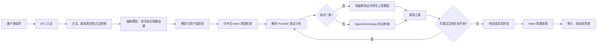

# Java `ploto-llm` 业务流程与配置参考

本文总结 Java 版本 `ploto-llm` 的实际业务行为，作为 C++ `ai-server` 设计、实现和联调时的业务基线。

- 分析基线：`/home/dear/CLionProjects/ploto-gateway`，提交 `22c2bf543b96`
- 分析日期：2026-07-23
- 依据优先级：当前生产代码与对应测试 > `ploto-gateway/documents` 中的设计文档
- 分析范围：入口协议、认证授权、配置、路由、上游选择、协议转换、重试、限流、审计和错误语义
- 不在范围内：Java 语言特性、依赖注入方式、类层次、线程模型和具体框架 API

文中的“客户端协议”是调用网关时使用的 OpenAI 或 Anthropic 协议；“Provider 协议”是网关调用上游时使用的协议；“模型名”默认指客户端看到的逻辑模型名；“上游模型名”指 Provider 配置中的真实模型名。

> **C++ 项目明确差异（2026-07-23）**
>
> `fiber-gateway-cpp/apps/ai-server` 不实现 OpenAI 与 Anthropic 之间的隐式协议桥接。各 Provider 供应商已经同时提供 `openai-chat-completions` 和 `anthropic-messages`，C++ 网关只调用与客户端入口完全一致的 Provider 协议。
>
> 本文仍保留 Java 桥接流程，用于准确记录 Java 参考实现；所有桥接请求转换、响应转换、桥接 SSE 状态机和 `protocol_bridge_*` 错误均不属于 C++ 实现范围。

| 行为 | Java 参考实现 | C++ 项目决定 | 有意差异 | 应验证的 C++ 契约 |
| --- | --- | --- | --- | --- |
| Provider 协议匹配 | 同协议优先；没有同协议候选时自动桥接到另一协议 | 只接受与客户端入口完全一致的协议 | 是 | OpenAI 入口只调用 `openai-chat-completions`，Anthropic 入口只调用 `anthropic-messages` |
| Provider 配置 | 单个 Provider 可以只配置一种协议并依靠桥接服务另一入口 | 需要服务两个入口的 Provider 应同时配置两种协议 | 是 | 缺少当前入口协议的 Provider 不进入尝试计划 |
| 无同协议候选 | 尝试桥接；桥接也不可用时返回 503 | 直接返回 `provider_protocol_unsupported` | 是 | 不生成异协议尝试，不发生请求或响应转换 |
| 重试和 fallback | 每个阶段可能形成同协议尝试或桥接尝试 | 所有主 Provider、token 和 fallback 尝试始终保持客户端协议 | 是 | 重试过程中不能切换协议 |

## 1. 系统职责和总流程

Java `ploto-llm` 是一个带统一鉴权、模型授权、Provider 路由、协议转换和用量治理的 LLM 网关。它不直接实现模型推理，而是在请求被允许后选择一个上游 Provider，并保持客户端所选择的协议外观。

以下流程图描述 Java 参考实现，其中协议桥接分支不进入 C++ 项目范围：



关键业务原则如下：

1. 所有 LLM 请求先认证，再检查 HTTP 请求格式。
2. 客户端逻辑模型名决定授权规则、候选 Provider、负载均衡和限流规则。
3. Provider 配置中的模型名会替换客户端模型名后再发送给上游。
4. Java 参考实现中同协议 Provider 优先；一个阶段内完全没有可用同协议候选时，才尝试跨协议桥接。C++ 项目只保留同协议选择。
5. Provider 和 API token 的尝试顺序在请求开始调用上游前一次性生成，尝试次数有限。
6. token 限流先准入、后按实际用量结算，不预占本次请求的预计 token。
7. 流式响应一旦开始，就不再切换 Provider。
8. 客户端始终看到自己调用时使用的协议格式，包括成功、流式事件和网关生成的错误。

## 2. 对外和内部 HTTP 接口

| 路径 | 用途 | 客户端协议 | 认证 | 正文上限 |
| --- | --- | --- | --- | --- |
| `POST /v1/chat/completions` | 聊天补全 | OpenAI | BT1 | 4 MiB |
| `POST /v1/messages` | Messages | Anthropic | BT1 | 4 MiB |
| `POST /v1/message` | `/v1/messages` 的兼容别名 | Anthropic | BT1 | 4 MiB |
| `POST /internal/llm/rate-limit/check` | 限流 owner 节点准入检查 | 内部 JSON | 当前没有 BT1 校验 | 64 KiB |
| `POST /internal/llm/rate-limit/settle` | 限流 owner 节点用量结算 | 内部 JSON | 当前没有 BT1 校验 | 64 KiB |
| `GET /metrics` | Prometheus 指标 | 文本 | 当前没有 BT1 校验 | 无请求正文 |
| `GET /_metric_prometheus` | 指标接口旧别名 | 文本 | 当前没有 BT1 校验 | 无请求正文 |

当前没有对外的 `/v1/embeddings` 路由。Provider 配置虽然能识别 `openai-embedding`，但该协议目前只会进入配置注册表，不能通过现有 LLM 入口执行。

不属于上述固定路径的请求会继续按路径首段寻找其他业务路由；没有匹配项时返回 404。

## 3. 配置体系

### 3.1 配置来源和公共包络

LLM 业务配置来自 Nacos，配置类型为 JSON。当前客户端使用 `public` namespace、空 tenant，固定使用配置组：

```text
LLM-SERVER
```

所有配置使用相同包络：

```json
{
  "version": 1,
  "data": {}
}
```

公共规则：

- `version` 是配置快照的观测字段，会随运行快照记录。
- 当前实现不要求 `version` 必须递增，也不拒绝回退版本；省略时等价于 `0`。
- 实际变更监听由 Nacos 内容更新驱动，不以 `version` 判断是否刷新。
- 未识别的 JSON 字段会被忽略，不会导致配置加载失败。
- 协议枚举值如果无法识别，会按无效协议处理并使 Provider 配置失败。
- 推荐使用本文给出的 kebab-case 字段名；部分字段兼容 camelCase，详见各节。

配置依赖关系为：

```text
ploto.ai-llm.auth.bt1.keys

ploto.ai-llm.models
  ├── ploto.ai-llm.provider.<provider-name>
  ├── ploto.ai-llm.user-group.<group-name>
  └── 每个模型内嵌的 rate-limit 规则

Nacos 当前服务实例列表
  └── token 限流分片环
```

建议先发布 BT1 key、用户组和 Provider，再发布模型总表。模型引用的 Provider 尚未加载时，模型路由仍可能建立，但请求会因 Provider 配置不可用返回 503；用户组尚未加载时按空成员组处理。

### 3.2 BT1 key 配置

#### Nacos 标识

```text
dataId: ploto.ai-llm.auth.bt1.keys
group:  LLM-SERVER
```

#### 推荐格式

```json
{
  "version": 1,
  "data": {
    "clockSkewSec": 60,
    "keys": [
      {
        "kid": "key-a",
        "secret": "base64:REPLACE_WITH_STANDARD_BASE64"
      },
      {
        "kid": "key-b",
        "secret": "REPLACE_WITH_RAW_SECRET"
      }
    ]
  }
}
```

| 字段 | 必填 | 规则 |
| --- | --- | --- |
| `data.clockSkewSec` | 否 | 默认 `0`；范围 `0..300` 秒；只用于过期时间容差 |
| `data.keys` | 是 | 至少一个 key |
| `keys[].kid` | 是 | 1 到 16 个字符；只允许字母、数字、`_`、`-`；不可重复 |
| `keys[].secret` | 是 | 非空；`base64:` 前缀表示其余部分按标准 Base64 解码，否则按原始 UTF-8 文本使用 |

首次加载为空或非法时，认证能力无法初始化；已经成功加载后，新配置非法会被拒绝，旧 key 环继续生效。

配置更新不会主动撤销已经签发的 token。要完成 key 轮换，通常应先同时保留旧、新 `kid`，待旧 token 生命周期结束后再删除旧 key。

### 3.3 用户组配置

#### Nacos 标识

```text
dataId: ploto.ai-llm.user-group.<group-name>
group:  LLM-SERVER
```

#### 示例

```json
{
  "version": 1,
  "data": {
    "name": "research",
    "users": [
      "alice",
      "bob"
    ]
  }
}
```

| 字段 | 必填 | 规则 |
| --- | --- | --- |
| Data ID 后缀 `<group-name>` | 是 | 1 到 64 个字符；只允许字母、数字、`_`、`-` |
| `data.name` | 是 | 必须与 Data ID 后缀完全一致，区分大小写 |
| `data.users` | 否 | 缺失或空数组表示空组；空字符串成员被跳过；重复成员去重 |

用户名按 BT1 token 中解析出的用户名做精确、区分大小写的匹配。用户组本身没有 `enabled` 字段；要暂时禁用某组，可以把 `users` 设为空数组。

用户组更新会直接作用于后续授权检查，不需要重建模型路由。首次配置非法会导致该引用无法正确初始化；后续非法更新保留上一份有效成员表。

### 3.4 Provider 配置

#### Nacos 标识

```text
dataId: ploto.ai-llm.provider.<provider-name>
group:  LLM-SERVER
```

#### HTTP 地址示例

```json
{
  "version": 3,
  "data": {
    "provider": "openai-a",
    "baseurl": "https://llm-a.example.com",
    "api-tokens": [
      {
        "name": "token-1",
        "token": "REPLACE_WITH_PROVIDER_TOKEN_1"
      },
      {
        "name": "token-2",
        "token": "REPLACE_WITH_PROVIDER_TOKEN_2"
      }
    ],
    "protocol": [
      {
        "type": "openai-chat-completions",
        "path": "/v1/chat/completions",
        "model": "gpt-upstream"
      },
      {
        "type": "anthropic-messages",
        "path": "/v1/messages",
        "model": "claude-upstream"
      }
    ]
  }
}
```

#### 服务发现地址示例

```json
{
  "version": 1,
  "data": {
    "provider": "internal-llm",
    "baseurl": "service://llm-provider.internal",
    "api-tokens": [],
    "protocol": [
      {
        "type": "openai-chat-completions",
        "path": "/v1/chat/completions",
        "model": "internal-chat"
      }
    ]
  }
}
```

| 字段 | 必填 | 规则 |
| --- | --- | --- |
| Data ID 后缀 `<provider-name>` | 是 | 1 到 128 个字符；只允许字母、数字、`_`、`-` |
| `data.provider` | 是 | 必须与 Data ID 后缀完全一致，区分大小写 |
| `data.baseurl` | 是 | 支持 `http://`、`https://`、`service://`；结尾 `/` 会移除 |
| `data.api-tokens` | 否 | 可以缺失或为空；表示调用无凭证上游，不发送认证头 |
| `api-tokens[].name` | 条目存在时必填 | 非空且在同一 Provider 内唯一 |
| `api-tokens[].token` | 条目存在时必填 | 非空；只作为上游凭证，不应写入示例或普通日志 |
| `data.protocol` | 是 | 至少一个协议；同一 Provider 内协议类型不可重复 |
| `protocol[].type` | 是 | 见下表 |
| `protocol[].path` | 是 | 非空且必须以 `/` 开头 |
| `protocol[].model` | 是 | 非空；请求发往该协议时使用的上游模型名 |

兼容别名：

| 推荐字段 | 兼容字段 |
| --- | --- |
| `baseurl` | `baseUrl` |
| `api-tokens` | `apiTokens` |
| `protocol` | `protocols` |

支持的 Provider 协议：

| `type` | 当前用途 |
| --- | --- |
| `openai-chat-completions` | 可由 `/v1/chat/completions` 直连，也可承接 Anthropic 请求的桥接调用 |
| `anthropic-messages` | 可由 `/v1/messages` 直连，也可承接 OpenAI 请求的桥接调用 |
| `openai-embedding` | 配置可加载，但当前没有可执行的入站路由 |

`baseurl` 的两种业务语义：

- `http://` 或 `https://`：固定地址调用。
- `service://<service-key>`：按服务发现结果调用；服务不存在或没有可用实例时，上游调用失败。

空 `api-tokens` 是当前代码明确支持的业务模式。此时每个 Provider 只生成一次无凭证尝试，不发送 `Authorization`。这与旧调试文档中“空 token 会导致 `provider_config_unavailable`”的描述不同。

Provider 第一次收到非法配置时无法初始化；已有有效配置后，非法更新会保留旧快照。有效 Provider 配置更新会触发所有引用该 Provider 的模型项目重建，使地址、协议、模型和 token 列表一起切换。

### 3.5 模型路由总表

#### Nacos 标识

```text
dataId: ploto.ai-llm.models
group:  LLM-SERVER
```

#### 完整示例

```json
{
  "version": 7,
  "data": [
    {
      "model-name": "company-chat.1",
      "providers": [
        "openai-a",
        "openai-b"
      ],
      "fallback-provider": "openai-fallback",
      "allow-user-groups": [
        "research",
        "product"
      ],
      "load-balance": {
        "policy": "rendezvous-hash",
        "hash-source": "prompt-prefix",
        "prefix-max-bytes": 2048,
        "max-primary-attempts": 2,
        "fallback-enabled": true,
        "retryable-status": [
          429,
          502,
          503,
          504
        ]
      },
      "rate-limit": {
        "window-duration-millis": 60000,
        "max-tokens-per-window": 100000
      }
    }
  ]
}
```

#### 模型字段

| 字段 | 必填 | 规则和含义 |
| --- | --- | --- |
| `model-name` | 是 | 1 到 128 个字符；只允许字母、数字、`_`、`-`、`.`；总表内唯一 |
| `providers` | 条件必填 | 主 Provider 列表；条目不可重复；可以为空，但此时必须有 fallback |
| `fallback-provider` | 否 | 单个兜底 Provider；不能与 `providers` 中任一项重复 |
| `allow-user-groups` | 否 | 允许访问的用户组；空或缺失表示所有已认证用户可访问；重复项自动去重 |
| `load-balance` | 否 | 负载均衡、主 Provider 尝试上限、fallback 和可重试状态配置 |
| `rate-limit` | 否 | 缺失表示该模型不做 token 限流 |

模型配置中的 Provider 只引用名字，真实地址、token、协议路径和上游模型来自各 Provider 的独立 Data ID。

兼容别名：

| 推荐字段 | 兼容字段 |
| --- | --- |
| `model-name` | `modelName` |
| `fallback-provider` | `fallbackProvider` |
| `allow-user-groups` | `allowUserGroups` |
| `load-balance` | `loadBalance` |
| `rate-limit` | `rateLimit` |

#### `load-balance` 字段

| 字段 | 默认值 | 当前语义 |
| --- | --- | --- |
| `policy` | `rendezvous-hash` | 当前只实现该策略；其他值会静默归一为该值 |
| `hash-source` | `prompt-prefix` | 当前只实现该来源；其他值会静默归一为该值 |
| `prefix-max-bytes` | `2048` | 生成内容路由键时最多保留的 UTF-8 字节数；小于等于 0 恢复默认值 |
| `max-primary-attempts` | `0` | 最多尝试多少个不同的主 Provider；`0` 表示全部；负数归一为 `0` |
| `fallback-enabled` | `true` | 是否把 fallback Provider 的尝试追加到计划末尾 |
| `retryable-status` | `[429, 502, 503, 504]` | Provider 状态码重试集合；缺失或空数组恢复默认值 |

`max-primary-attempts` 限制的是不同主 Provider 的数量，不是 HTTP 调用总次数。一个 Provider 配置了多个可用 API token 时，该 Provider 的全部 token 都会形成独立尝试。

#### `rate-limit` 字段

| 字段 | 必填 | 规则和含义 |
| --- | --- | --- |
| `window-duration-millis` | 是 | 必须大于 `0` |
| `max-tokens-per-window` | 是 | 必须大于等于 `0`；`0` 表示从第一次检查起拒绝全部请求 |

兼容别名：`windowDurationMillis`、`maxTokensPerWindow`。

### 3.6 配置刷新和生效边界

| 变更 | 生效方式 | 非法更新行为 |
| --- | --- | --- |
| BT1 key | 替换认证 key 环 | 首次失败阻止初始化；后续保留旧值 |
| 用户组 | 替换该组成员快照，后续授权立即读取新成员 | 首次失败表示该组未完成初始化；尚未加载到有效快照时匹配结果为空；后续保留旧值 |
| Provider | 更新 Provider 快照，并重建引用它的模型项目 | 首次失败使 Provider 不可用；后续保留旧值 |
| 模型总表 | 构建完整的新模型、授权、Provider 执行资源和限流规则后整体切换 | 首次失败阻止模型项目初始化；后续保留旧项目 |
| 服务实例列表 | 重建 token 限流一致性哈希环 | 空列表会使有限流规则的请求失败关闭 |

模型项目切换是快照式的：新请求进入新路由；已经进入旧路由的请求继续使用旧项目，完成后旧资源才释放。因此一次配置更新不会在请求中途把 Provider 或授权规则替换成新版本。

## 4. 启动和运行参数

下列不是 `LLM-SERVER` 组内的 JSON 配置，而是进程启动属性：

| 属性 | 默认值 | 业务含义 |
| --- | --- | --- |
| `env` | `dev` | 选择环境默认参数 |
| `ploto.idc` | `dev` 环境默认为 `dev` | 实例 IDC；非开发环境必须提供 |
| `ploto.zone` | `dev` 环境默认为 `daily1` | 实例可用区；非开发环境必须提供 |
| `ploto.cluster` | `dev` 环境默认为 `dev` | 实例集群；非开发环境必须提供 |
| `nacos.serverIp` | 环境内置值 | 覆盖 Nacos 地址 |
| `nacos.serverHttpPort` | Nacos 客户端默认值 | 覆盖 Nacos HTTP 端口 |
| `nacos.serverGrpcPort` | Nacos 客户端默认值 | 覆盖 Nacos gRPC 端口 |
| `nacos.username` | 环境内置值 | 覆盖 Nacos 用户名 |
| `nacos.password` | 环境内置值 | 覆盖 Nacos 密码 |
| `ploto.nacos.group` | `DEFAULT_GROUP` | 服务注册和发现使用的 Nacos 服务组；不要与配置组 `LLM-SERVER` 混淆 |
| `fiber.http.server.serverPort` | `16688` | HTTP 服务端口，也是限流分片节点地址的一部分 |
| `llm.audit.logConversation` | `true` | 是否写会话审计日志 |
| `llm.audit.maxStringChars` | `32768` | 结构化响应等单个字符串的审计截断阈值；不限制原始请求正文 |

应用名在入口固定为 `ploto-ai-server`。当前固定业务限制还包括：Provider 请求超时 300 秒、限流 owner 远程调用超时 3 秒、LLM 入站正文上限 4 MiB、内部限流接口正文上限 64 KiB。这些值目前不是模型或 Provider 配置字段。

## 5. 请求处理流程

### 5.1 入口顺序

一次请求按以下顺序处理：

1. 建立请求审计上下文和全链路监控。
2. 从请求头读取 BT1 token 并认证。
3. 检查方法必须为 `POST`。
4. 检查 `Content-Type` 必须为 `application/json`；大小写不敏感，允许 `; charset=...` 参数。
5. 检查正文不超过 4 MiB，并读取完整正文。
6. 从 JSON 中抽取模型名、`stream`、路由键候选和消息文本，同时保留完整原始正文。
7. 按逻辑模型和用户组做授权。
8. 记录会话请求审计。
9. 按 `用户名 + 逻辑模型名` 做 token 限流准入检查。
10. 根据客户端协议、路由键和运行健康状态生成有限的 Provider 尝试计划。
11. 对每次尝试改写上游模型；Java 必要时做协议桥接，然后调用上游。C++ 只执行同协议调用。
12. 在满足重试条件时继续下一尝试；否则返回结果或错误。
13. 从成功响应中提取实际 token 用量并结算；失败、取消或无 usage 时只关闭本次限流会话，不增加用量。
14. 写请求明细、会话审计、token 使用事件和监控指标，并释放请求资源。

由于认证早于方法和媒体类型检查，一个没有有效 token 的 `GET` 请求会先得到 401，而不是 405。

### 5.2 轻量字段抽取

入口不会为了路由决策解析全部业务字段，只抽取：

- 公共：`model`、`stream`、`metadata.route_key`、`metadata.routeKey`、消息 `role` 和文本 `content`
- OpenAI：额外抽取 `prompt_cache_key`
- Anthropic：额外抽取 `container` 和文本形式的 `system`

`stream` 只有 JSON 布尔值 `true` 才进入流式路径；缺失或 `false` 进入同步路径。

当前轻量抽取对对象或数组形式的 `messages[].content`、Anthropic `system` 只跳过容器，不把其中的文本块纳入路由键。因此多模态或内容块请求的哈希输入可能只包含角色和分隔符，最后退化程度高于纯文本请求。

## 6. BT1 认证和模型授权

### 6.1 token 来源

认证头优先级：

1. `Authorization`
2. 仅当 `Authorization` 缺失或为空时，回退到 `x-api-key`

`Authorization: Bearer <token>` 的 `Bearer` 前缀大小写不敏感。若 `Authorization` 存在但不是 Bearer 格式，整个头值会被当作 BT1 token 校验，不再回退到 `x-api-key`。

### 6.2 BT1 格式

```text
BT1.<kid>.<user>.<exp>.<rnd>.<mac>
```

| 段 | 语义和校验 |
| --- | --- |
| `BT1` | 固定版本标识 |
| `kid` | 从 BT1 key 配置中选择密钥；1..16 个允许字符 |
| `user` | 无填充 Base64URL 编码的 UTF-8 用户名；解码后 1..64 字节 |
| `exp` | Unix 秒级过期时间；只允许无前导零的非负十进制整数 |
| `rnd` | 无填充 Base64URL；固定 22 个字符，用于增加 token 唯一性 |
| `mac` | 前五段原文的 HMAC-SHA256；无填充 Base64URL；固定 43 个字符 |

整个 token 最长 512 个字符。签名使用常量时间比较。有效期条件是：

```text
当前时间 <= exp + clockSkewSec
```

BT1 提供身份字段完整性和过期校验，但当前不提供 token 加密、服务端撤销列表或重放检测。

认证失败统一返回 401：格式、key 或签名错误为 `invalid_token`，超过过期容差为 `expired_token`。

### 6.3 模型授权

授权按以下规则执行：

1. `model` 必须存在，且只能由字母、数字、`_`、`-`、`.` 组成，长度不超过 128。
2. 模型必须存在于 `ploto.ai-llm.models` 当前快照中。
3. `allow-user-groups` 为空时，任意已通过 BT1 的用户都可访问。
4. 配置了用户组时，用户只要属于任意一个允许组即可访问。
5. 当前源码对用户名 `zhangwang` 存在硬编码授权绕过：该用户无需匹配任何组即可访问所有已配置模型。

第 5 条是当前实现中的特殊业务例外，不是配置能力。它扩大了该用户名对应 BT1 token 的权限，迁移或上线前应明确决定是否保留。

授权错误：

| 场景 | HTTP 状态 | 错误名 |
| --- | --- | --- |
| 缺少或非法模型名 | 400 | `invalid_model` |
| 模型配置快照不可用 | 503 | `model_config_unavailable` |
| 模型不存在 | 403 | `model_not_available` |
| 用户无权访问模型 | 403 | `model_not_available` |

对外不区分“模型不存在”和“用户无权访问”，两者都使用 `model_not_available`。

## 7. Provider 解析、负载均衡和尝试计划

### 7.1 协议候选选择

本节先记录 Java 参考行为。C++ 项目不执行第 3 步的桥接查找；完全没有同协议候选时直接解析失败。

主 Provider 和 fallback Provider 分两个阶段独立解析。每个阶段的协议选择规则是：

1. 在该阶段的 Provider 中寻找与客户端协议完全一致的可用候选。
2. 只要存在至少一个同协议候选，该阶段就只使用同协议候选，不混入可桥接候选。
3. 只有完全没有同协议候选时，才查找可桥接到另一协议的候选。
4. Provider 配置尚未就绪、Provider 熔断中、所需协议缺失或 API token 暂时不可用的候选被过滤。
5. 如果 `api-tokens` 为空，生成一个无凭证候选。
6. 如果 `api-tokens` 有多个，每个当前可用 token 都生成一次独立尝试。

这意味着：若一个阶段在计划生成时有同协议候选，同时也有可桥接 Provider，后者不会作为该阶段的运行期重试后备。即使所有同协议调用随后失败，也不会在同一阶段临时跨协议；只有预先生成的 fallback 阶段还能继续。

### 7.2 路由键

OpenAI 请求的路由键优先级：

1. `metadata.route_key`
2. `metadata.routeKey`
3. `prompt_cache_key`
4. 按顺序拼接 `role:content\n`，最多 `prefix-max-bytes` 个 UTF-8 字节
5. 没有可用内容时使用逻辑模型名

Anthropic 请求的路由键优先级：

1. `metadata.route_key`
2. `metadata.routeKey`
3. `container`
4. `system` 加按顺序拼接的 `role:content\n`，最多 `prefix-max-bytes` 个 UTF-8 字节
5. 没有可用内容时使用逻辑模型名

相同路由键和相同候选集合会稳定得到相同排序，目的是提高 prompt cache 和会话局部性。

### 7.3 Rendezvous Hash 排序

当前唯一负载均衡策略为 Rendezvous Hash：

- Provider 分数基于 `SHA-256(routeKey + "\n" + providerName)` 的前 8 字节。
- 分数高的 Provider 优先；分数相同按 Provider 名排序。
- 同一 Provider 内，token 分数基于 `SHA-256(routeKey + "\n" + providerName + "\n" + tokenName)`。
- 没有路由键时保留配置顺序；正常已授权请求至少会退化到模型名，因此通常仍有稳定键。

最终顺序是：受 `max-primary-attempts` 限制后的主 Provider 及其 token 尝试，然后在 `fallback-enabled=true` 时追加 fallback Provider 的 token 尝试。

尝试列表在请求内是有限且不可扩张的，因此不会发生无界递归重试。

### 7.4 Provider 解析失败

无法生成任何尝试时返回 503：

| 错误名 | 含义 |
| --- | --- |
| `provider_config_unavailable` | 引用的 Provider 未加载、地址不可用或 Provider 当前熔断 |
| `provider_token_unavailable` | Provider 有 token 配置，但所有 token 都暂时不可用 |
| `provider_protocol_unsupported` | 所有候选都不支持客户端协议，也没有可用桥接方向 |

## 8. 上游调用、重试和临时摘除

### 8.1 上游请求

每次调用上游时：

- 方法固定为 `POST`。
- 路径来自 Provider 对应协议的 `path`。
- 客户端逻辑模型名替换为 Provider 协议中的上游 `model`。
- 有 token 时统一发送 `Authorization: Bearer <token>`；无 token 时不发送认证头。
- `Content-Type` 为 `application/json`。
- 同步请求的 `Accept` 为 `application/json`，流式请求为 `text/event-stream`。
- 客户端普通请求头不会整体透传；链路跟踪信息由网关单独注入。
- 请求超时为 300 秒。

Anthropic Provider 当前也使用 Bearer 认证，不会自动发送原生 Anthropic 常用的 `x-api-key` 或 `anthropic-version`。因此 Provider 必须兼容这种认证方式，或在上游前增加适配层。

### 8.2 可重试条件

只有同时满足以下条件才会继续下一尝试：

1. 错误被分类为可重试。
2. 客户端响应尚未开始。
3. 尝试列表中还有下一项。
4. 客户端连接仍然存活。

状态码重试的默认集合是 429、502、503、504。非业务框架异常默认可重试；网关内部 5xx 默认可重试，但 `protocol_bridge_invalid_response` 明确不重试。普通 4xx 请求错误不重试。

401、403、429 以及响应体中可识别的额度错误被视为 API token 级错误。只要响应尚未开始，它们会触发下一 token/Provider 尝试；其中 401 和 403 即使没有出现在 `retryable-status` 中也会重试。

### 8.3 token 暂时摘除

| 上游结果 | 默认摘除时间 | 范围 |
| --- | --- | --- |
| 429 或可识别额度错误 | 30 秒 | 当前 API token |
| 401、403 | 5 分钟 | 当前 API token |
| 正整数 `Retry-After: <seconds>` | 使用该秒数覆盖默认值 | 当前 API token |

只解析数字秒数形式的 `Retry-After`；HTTP 日期形式会回退到默认时间，`0` 或负数也使用默认值。

### 8.4 Provider 熔断

传输异常和配置为可重试的 Provider 状态错误会累计 Provider 级连续失败。连续 3 次后，该 Provider 整体暂停 30 秒。暂停期结束后自动恢复尝试。

任意成功调用会清除 Provider 连续失败状态，并恢复本次成功使用的 token 状态。Provider 运行状态在配置刷新时保留；已从配置删除的 token 状态会清除。

### 8.5 响应开始后的边界

流式上游返回成功起始事件后，客户端响应被视为已经开始。此后发生解析、桥接或网络错误：

- 不再尝试其他 token、Provider 或 fallback。
- 记录为“响应已开始后的流失败”。
- 终止当前客户端流，无法再改写为一个完整的协议错误响应。

## 9. 直通与协议桥接

本节的桥接部分只描述 Java 参考实现。C++ 项目只实现 9.1 的同协议路径，不实现 9.2 至 9.5 所述转换能力。

### 9.1 同协议直通

客户端协议与 Provider 协议一致时：

- 请求保留原 JSON 结构和未知字段，只替换已存在的 `model` 和 `stream` 字段。
- 如果原请求没有 `stream` 字段，网关不会主动补字段，但仍按非流式路径调用上游。
- 同步成功响应和最终上游错误正文按原协议原样返回。
- SSE 会被解析并重新封装；OpenAI 流正常结束时补发 `[DONE]`。

因此直通模式对上游扩展字段兼容性较好，但 JSON 会重新序列化，不能假设字节级完全不变。

### 9.2 桥接触发

当前桥接方向固定启用：

```text
OpenAI Chat Completions <-> Anthropic Messages
```

没有模型级 `bridge-enabled` 开关。只要某阶段没有可用同协议候选，而存在另一协议候选，就会自动生成桥接计划。这与旧桥接设计文档中“由模型配置显式开启”的目标不同。

上述行为仅属于 Java 版本。C++ 不增加桥接开关，也不实现隐式桥接；缺少当前入口协议时按 `provider_protocol_unsupported` 处理。

### 9.3 OpenAI 请求桥接到 Anthropic

主要映射：

| OpenAI | Anthropic |
| --- | --- |
| `model` | `model`，随后替换为 Provider 上游模型 |
| `stream` | `stream` |
| `max_completion_tokens` / `max_tokens` | `max_tokens`，都缺失时使用 1024 |
| `temperature`、`top_p` | 同名字段 |
| `stop` | `stop_sequences` |
| system/developer 消息 | 顶层 `system` |
| user/assistant 消息 | `messages` |
| tool 消息 | user 消息内的 `tool_result` |
| function tool / tool call | `tools` / `tool_use` |
| `parallel_tool_calls` | `disable_parallel_tool_use` 的反值 |
| `metadata`、`service_tier` | 对应字段 |

明确拒绝的已知能力包括：

- audio、modalities、prediction、response_format、web_search_options
- logprobs、top_logprobs
- frequency/presence penalty
- 旧版 `functions`、`function_call`
- `n > 1`
- 非 function tool
- 无法转换为文本的 content、tool result 或非法 tool arguments

Anthropic 响应转换为 OpenAI 时只生成一个 `choices[0]`，文本块合并为 assistant content，`tool_use` 转成 `tool_calls`，并映射 stop reason 和 usage。

### 9.4 Anthropic 请求桥接到 OpenAI

主要映射：

| Anthropic | OpenAI |
| --- | --- |
| `model` | `model`，随后替换为 Provider 上游模型 |
| `stream` | `stream` |
| `max_tokens` | `max_completion_tokens` |
| `temperature`、`top_p` | 同名字段 |
| `stop_sequences` | `stop` |
| 顶层 `system` | system 消息 |
| user/assistant 消息 | `messages` |
| `tool_use` | assistant `tool_calls` |
| `tool_result` | tool 消息 |
| `tools` / `tool_choice` | function tools / tool choice |
| `disable_parallel_tool_use` | `parallel_tool_calls` 的反值 |
| `metadata`、`service_tier` | 对应字段 |

明确拒绝的已知能力包括：

- `top_k`
- `thinking`
- 非空 `container`
- `inference_geo`
- `output_config.format`
- image、document 等非文本且无稳定映射的内容块

OpenAI 响应转换为 Anthropic 时只读取第一个 choice，assistant 文本和 tool calls 转成 content blocks，并映射 finish reason 和 usage。tool arguments 必须是可解析的 JSON 对象。

### 9.5 桥接错误

| 场景 | HTTP 状态 | 错误名 | 是否重试 |
| --- | --- | --- | --- |
| 请求包含不支持或无法稳定转换的字段 | 400 | `protocol_bridge_unsupported_feature` | 否 |
| 上游成功响应无法转换为客户端协议 | 502 | `protocol_bridge_invalid_response` | 明确禁止 |

已知字段有明确拒绝清单，但全局 JSON 解析会忽略未知字段。因此未来协议新增但本实现尚未建模的字段，在桥接模式下可能被静默丢弃；直通模式则会保留它们。

同步和流式桥接都以客户端协议作为最终外观。OpenAI 客户端仍收到 OpenAI JSON/SSE，Anthropic 客户端仍收到 Anthropic JSON/SSE。

## 10. token 限流

### 10.1 限流键和准入

仅配置了 `rate-limit` 的模型参与限流。限流键是：

```text
BT1 username + 逻辑 model-name
```

未配置规则的模型直接放行，不依赖限流分片环。

有限流规则时，准入只检查当前窗口已结算用量：

- `usedTokens < maxTokensPerWindow`：允许并返回 ticket。
- `usedTokens >= maxTokensPerWindow`：拒绝，返回 429 `token_rate_limit_exceeded`。

检查阶段不会估算或预占本次请求用量。因此多个并发请求可以在窗口尚未达限时同时通过，完成结算后总量可以超过上限。

### 10.2 分片 owner

所有当前服务实例形成一致性哈希环：

- 分片键为 `username + NUL + modelName`。
- 哈希使用 MurmurHash3 64 位结果。
- 每个节点当前权重为 1，每权重 200 个虚拟节点。
- 当前只选择一个 primary owner，不选择副本。
- 只接受服务发现列表中的 IPv4 实例。
- owner 是本机时直接检查；否则调用目标实例的内部 check/settle 接口。

远程 owner 调用超时 3 秒，没有本地降级。分片环为空、远程 owner 不可达、或 owner 节点没有相同模型限流规则时，请求失败关闭，不会按无限额放行。

### 10.3 窗口和超额恢复

窗口以该键第一次 check 的时间为起点。正常恢复时间为：

```text
windowStart + windowDuration
```

结算后若用量超过上限，恢复时间按超额比例延长：

```text
recoverAt = windowEnd
          + ceil((usedTokens - maxTokens) * windowDuration / maxTokens)
```

`maxTokens=0` 时不会做比例计算，恢复时间仍为一个基础窗口，但每个新窗口的首次检查也立即被拒绝。

### 10.4 结算

成功请求从 Provider usage 中提取总 token，并使用准入 ticket 回写最初选定的 owner。失败、取消、客户端断开或响应没有 usage 时，执行“不计用量结算”，只减少该 owner 上的 in-flight 数量。

一次正常网关请求的限流会话有本地一次性保护，避免自身重复结算。但 owner 的内部 settle 接口没有全局 ticket 去重表；如果外部重复提交相同有效 ticket 且 `countUsage=true`，同一用量可能被重复累计。

模型限流规则版本、窗口参数改变或本地状态被清理重建后，旧 ticket 会变成 stale，结算不再计入新状态。

本地限流状态在以下条件同时满足后清理：

- 没有 in-flight 请求。
- 距离最后访问至少 10 分钟。
- 已经过该状态的 `recoverAt`。

清理任务每 1 分钟执行一次。

### 10.5 分布式一致性边界

当前实现能让稳定成员列表下的相同键路由到同一 owner，但不提供：

- owner 状态副本
- 节点间状态复制
- 持久化
- 成员变化时的状态迁移
- owner 故障后的用量恢复

当服务实例加入、离开或哈希环变化时，新请求可能被映射到新 owner，旧 owner 的窗口用量不会迁移，因而可能出现额度提前恢复或两个 owner 并存的过渡状态。这不满足旧需求文档所描述的严格集群一致性目标。

### 10.6 结算对响应的影响

非流式成功响应会先完成限流结算，再写给客户端。结算失败可能把已经成功的上游调用转成客户端错误。

流式响应可能已经向客户端发送数据，结束前才做结算。若结算失败，流会异常结束，无法再返回一个完整错误体，也可能缺少正常结束标记。

## 11. 内部限流接口格式

这些接口当前和业务入口位于同一 HTTP 服务，但不做 BT1 认证，必须依赖网络隔离或上游访问控制，不能直接暴露给不可信客户端。

### 11.1 check

请求：

```json
{
  "userId": "alice",
  "modelName": "company-chat.1"
}
```

允许响应示例：

```json
{
  "ruleMatched": true,
  "allowed": true,
  "usedTokens": 1200,
  "maxTokens": 100000,
  "recoverAtMillis": 1784772000000,
  "ticket": {
    "generation": 2,
    "windowStartMillis": 1784771940000
  }
}
```

### 11.2 settle

请求：

```json
{
  "userId": "alice",
  "modelName": "company-chat.1",
  "ticket": {
    "generation": 2,
    "windowStartMillis": 1784771940000
  },
  "tokens": 850,
  "countUsage": true
}
```

响应示例：

```json
{
  "applied": true,
  "stale": false,
  "usageCounted": true,
  "usedTokens": 2050,
  "recoverAtMillis": 1784772000000
}
```

内部接口要求 `POST`、`application/json`，错误体为：

```json
{
  "ok": false,
  "message": "error description"
}
```

## 12. 响应和错误外观

OpenAI 入口的网关错误保持 OpenAI 结构：

```json
{
  "error": {
    "message": "model is not available",
    "type": "invalid_request_error",
    "param": "model",
    "code": "model_not_available"
  }
}
```

Anthropic 入口的网关错误保持 Anthropic 结构：

```json
{
  "type": "error",
  "error": {
    "type": "permission_error",
    "message": "model is not available"
  },
  "request_id": null
}
```

主要状态类别：

| HTTP 状态 | 典型场景 |
| --- | --- |
| 400 | 请求正文读取或 JSON 抽取失败、缺失/非法模型、桥接请求不支持 |
| 401 | BT1 token 缺失、非法或过期 |
| 403 | 模型不存在或用户组未授权 |
| 405 | 已认证请求使用非 POST 方法 |
| 413 | LLM 正文超过 4 MiB |
| 415 | Content-Type 不是 JSON |
| 429 | 本地模型 token 额度耗尽，或最终上游 429 |
| 502 | 桥接时上游成功响应无法转换 |
| 503 | Provider 配置、token、协议或模型配置不可用 |
| 500 | 限流分片环、远程 owner 或结算等内部治理链路异常，以及其他未映射异常 |

同协议直通且重试耗尽后，最终上游 HTTP 状态和错误正文按原协议返回。Java 发生跨协议桥接时，上游错误会转换成客户端协议的错误结构；C++ 项目没有该分支。

## 13. 审计和可观测性

### 13.1 请求明细

每个请求记录一条请求明细，主要包括：

- 请求 ID、时间、方法、路径、来源地址、Content-Type、User-Agent
- BT1 用户和 `kid`，但不记录 BT1 token
- 请求正文字节数和 SHA-256
- 请求模型、授权结果和限流结果
- 每次 Provider 尝试的 Provider 名、API token 名、协议、上游模型、路径、配置版本、是否 fallback、桥接方向、状态和耗时
- 最终状态、响应字节数、总耗时、客户端是否中断
- 可提取的 token usage

只记录 API token 的配置名称，不记录 token 明文。

### 13.2 会话审计

`llm.audit.logConversation=true` 时记录会话审计。当前入口会把完整原始请求 JSON 作为 `request.rawBody` 写入会话日志，最多可接近 4 MiB。

`llm.audit.maxStringChars` 只对结构化响应、错误等经过清洗的字符串生效，不会截断 `request.rawBody`。因此请求中的 prompt、工具参数、metadata 和可能的业务敏感信息会完整落盘。这是上线前必须评估的数据安全和磁盘容量风险。

默认日志滚动策略：

| 日志 | 保留天数 | 单文件上限 | 总量上限 |
| --- | --- | --- | --- |
| 请求明细 | 15 天 | 100 MiB | 500 MiB |
| 会话审计 | 7 天 | 100 MiB | 1 GiB |

### 13.3 token usage

同步响应从最终 JSON usage 提取用量；流式响应合并各 chunk/event 中的 usage。审计和用量事件记录输入缓存、非缓存输入、输出和总 token。Provider 没有返回可识别 usage 时，本次请求不增加模型 token 限流用量。

## 14. 已确认的现状差异和风险

本节用于区分“当前真实行为”和旧文档中的目标设计。

| 项目 | 当前源码行为 | 旧文档或潜在预期 | 影响 |
| --- | --- | --- | --- |
| 空 Provider token | 合法，按无凭证上游执行 | 旧调试文档称会导致 Provider 不可用 | C++ 兼容实现不应强制要求 token |
| 协议桥接 | Java 固定双向启用，无模型级开关 | C++ 明确不实现；Provider 同时提供两种协议 | 有意不兼容；C++ 不产生异协议调用和 `protocol_bridge_*` 错误 |
| 限流一致性 | 单 owner、无副本和状态迁移 | 旧需求要求严格集群一致 | 成员变化或故障会重置/分裂用量 |
| 特殊用户名 | `zhangwang` 绕过全部用户组 | 配置模型没有表达此规则 | 高权限隐式后门，需明确保留与否 |
| 内部限流接口 | 与主服务同端口且无 BT1 | “内部接口”通常假设受保护 | 必须网络隔离或增加认证 |
| 会话请求日志 | 完整保存原始请求，默认开启 | 截断参数容易被误认为覆盖全部字符串 | 敏感信息与磁盘风险 |
| Anthropic 上游认证 | 使用 Bearer，不发 `x-api-key`、`anthropic-version` | 原生 Anthropic API 常需要专用头 | 只能直连兼容上游或增加适配 |
| Embedding | 配置协议可加载 | 协议名容易让人认为已对外支持 | 当前没有 embeddings 入站路由 |
| 未知 JSON 字段 | 配置和桥接解析时忽略 | 设计原则希望不静默丢字段 | 桥接可能丢失未来新增字段 |
| 限流结算失败 | 可能影响已成功的非流式响应或截断流 | 常见预期是治理旁路不改变成功结果 | owner 稳定性直接影响业务成功率 |

另外需要注意：

- 不支持的 `load-balance.policy` 和 `hash-source` 不报错，而是静默恢复为当前唯一实现。
- 配置 `version` 不做单调性校验，旧版本内容也可以覆盖新版本。
- Java Provider 计划生成后不会因为同协议尝试失败而临时加入桥接候选；C++ 尝试计划从始至终只包含同协议候选。
- 401、403 被视为 token 故障并自动尝试后续 token，可能放大错误凭证配置下的上游调用量。
- check 不预占 token，并发请求可以合法穿透当前余额后在结算时超额。
- 内部 settle 接口本身不防重复提交。

## 15. 推荐配置和排查顺序

### 15.1 发布顺序

1. 发布 `ploto.ai-llm.auth.bt1.keys`。
2. 发布所有会被引用的 `ploto.ai-llm.user-group.*`。
3. 发布所有会被引用的 `ploto.ai-llm.provider.*`。
4. 最后发布 `ploto.ai-llm.models`。
5. 确认服务实例已注册到同一服务发现组，有限流规则时分片环非空。

### 15.2 请求失败排查

1. 401：检查请求头选择、BT1 六段格式、`kid`、时钟、`exp` 和 key 配置。
2. 400 `invalid_model`：检查请求 JSON、`model` 是否存在以及名称字符范围。
3. 403 `model_not_available`：检查模型总表、用户组引用和用户精确匹配。
4. 429 `token_rate_limit_exceeded`：检查该用户名和逻辑模型的 owner、已用额度和 `recoverAtMillis`。
5. 503 `provider_config_unavailable`：检查 Provider Data ID、`baseurl`、服务发现实例和 Provider 熔断状态。
6. 503 `provider_token_unavailable`：检查所有 token 是否因 401、403、429 或额度错误被临时摘除。
7. 503 `provider_protocol_unsupported`：C++ 项目只检查当前入口的同协议配置；确认目标 Provider 同时配置了所需的 OpenAI/Anthropic 协议项。
8. Java 环境出现 `protocol_bridge_unsupported_feature` 时按第 9 节排查；该错误不属于 C++ 项目对外契约。
9. 流中途断开：检查响应开始后的 Provider 错误、桥接状态错误以及限流 settle 失败。

### 15.3 C++ 兼容实现应优先保持的契约

若 C++ `ai-server` 目标是业务兼容，至少应明确并测试以下契约：

- BT1 头选择、六段格式、HMAC、过期容差和错误名。
- 模型名和用户组授权规则，包括是否保留特殊用户绕过。
- 四类 Nacos 配置 Data ID、公共包络、字段别名、校验和刷新失败保旧行为。
- 空 `api-tokens` 的无凭证 Provider 语义。
- 主 Provider/fallback 分阶段、仅同协议的候选规则；不得生成异协议尝试。
- 路由键优先级、Rendezvous Hash 和一个 Provider 多 token 的尝试展开。
- 401/403/429 token 级摘除、Provider 连续失败熔断和响应开始后禁止重试。
- 直通时保留未知请求字段，只改写上游模型。
- 不实现 OpenAI/Anthropic 请求、响应或 SSE 的跨协议转换，也不暴露 `protocol_bridge_*` 错误。
- token 限流的 key、先检查后结算、超额延长恢复时间和 stale ticket 语义。
- OpenAI 与 Anthropic 各自的错误 JSON 和 SSE 外观。
- 审计字段、API token 不落明文，以及是否继续保留完整请求正文这一安全决策。

## 16. 源码和测试定位

业务结论主要由以下位置交叉确认：

- 应用入口和路由：`ai-server/src/main/.../startup/Main.java`、`AIRouter.java`
- 配置和动态路由：`ploto-llm/src/main/.../server/LlmRouteConfigWatcher.java`
- BT1 和用户组：`ploto-llm/src/main/.../auth/`
- 模型授权：`ploto-llm/src/main/.../model/`
- Provider 配置、计划、哈希和运行健康：`ploto-llm/src/main/.../provider/`
- OpenAI/Anthropic 入口执行：`ploto-llm/src/main/.../server/`
- Java 协议桥接参考（C++ 不实现）：`ploto-llm/src/main/.../bridge/`
- token 限流：`ploto-llm/src/main/.../limit/`
- 审计：`ploto-llm/src/main/.../audit/`
- 重点回归测试：`ExecutionPlanResolverTest`、`ProtocolExecutorsTest`、`LlmRouteConfigWatcherTest`、`Bt1TokenVerifierTest`、`TokenRateLimiterManagerTest`、`WindowTokenRateLimiterTest`
